# MRBS System Class Diagram

This document provides detailed class diagrams for the Meeting Room Booking System (MRBS) for Oriental Interest Group, showing technical implementation with attributes, operations, data types, and visibility modifiers.

---

## What is a Class Diagram?

A **Class Diagram** is a UML diagram that models the **technical structure** of the system, showing:

1. **Classes** - Code classes in the application
2. **Attributes with Types** - Properties with data types and visibility
3. **Operations/Methods** - Functions with parameters and return types
4. **Relationships** - Technical dependencies and associations
5. **Visibility Modifiers** - Public (+), Private (-), Protected (#)

### Difference from Domain Diagram

| Aspect | Domain Diagram (Business) | Class Diagram (Technical) |
|--------|---------------------------|---------------------------|
| **Focus** | What the business needs | How to build it in code |
| **Attributes** | Just names | + data types + visibility |
| **Operations** | ❌ None | ✅ All methods with signatures |
| **Visibility** | ❌ Not shown | ✅ `+`, `-`, `#` modifiers |
| **Types** | ❌ Omitted | ✅ Explicit (string, int, bool) |
| **Framework Details** | ❌ None | ✅ Laravel-specific (HasMany, etc.) |
| **Explanations** | Business meaning | Technical implementation |

---

## Class Diagram Notation

### Visibility Modifiers
- `+` **Public** - Accessible from anywhere
- `-` **Private** - Accessible only within the class
- `#` **Protected** - Accessible within class and subclasses

### Data Types
- **Primitive**: `string`, `int`, `bool`, `float`, `array`
- **Laravel**: `HasMany`, `BelongsTo`, `BelongsToMany`, `Builder`
- **PHP**: `Carbon`, `Collection`, `Model`
- **Database**: `bigint`, `varchar`, `text`, `timestamp`, `date`, `time`

### Method Notation
```
+ methodName(paramType $param): returnType
```

---

## Core Classes Diagram

```plantuml
@startuml MRBS_Class_Diagram

title MRBS Class Diagram - Technical Implementation

' ========== USER CLASS ==========

class User {
    ' Attributes
    - id: bigint
    - staff_number: string {unique}
    + name: string
    + email: string {unique}
    - password: string {hashed}
    + must_change_password: boolean
    + department: string {nullable}
    + phone: string {nullable}
    + role: string
    + status: string
    + last_login_at: timestamp {nullable}
    - remember_token: string {nullable}
    + created_at: timestamp
    + updated_at: timestamp
    + deleted_at: timestamp {nullable}
    
    ' Methods - Relationships
    + bookings(): HasMany
    + notificationPreferences(): HasOne
    
    ' Methods - Role Checks
    + isRegularUser(): bool
    + isAdmin(): bool
    + isDirector(): bool
    + isSysAdmin(): bool
    
    ' Methods - Permission Checks
    + canManageBookings(): bool
    + canManageRooms(): bool
    + canManageUsers(): bool
    + canAccessAudit(): bool
    + canAccessReports(): bool
    + canConfigureSystem(): bool
    
    ' Methods - Scopes
    + scopeActive(Builder $query): Builder
    + scopeByRole(Builder $query, string $role): Builder
    + scopeByDepartment(Builder $query, string $dept): Builder
    
    ' Methods - Accessors
    + getRoleDisplayAttribute(): string
    + getRoleBadgeAttribute(): string
    + getStatusBadgeAttribute(): string
    + wantsNotification(string $type): bool
    
    ' Methods - Mutators
    - setPasswordAttribute(string $value): void
}

' ========== ROOM CLASS ==========

class Room {
    ' Attributes
    - id: bigint
    + name: string {unique}
    + capacity: int
    + floor_location: string
    + description: text {nullable}
    + status: string
    + created_at: timestamp
    + updated_at: timestamp
    + deleted_at: timestamp {nullable}
    
    ' Methods - Relationships
    + amenities(): BelongsToMany
    + images(): HasMany
    + maintenanceSchedules(): HasMany
    + bookings(): HasMany
    
    ' Methods - Scopes
    + scopeActive(Builder $query): Builder
    + scopeAvailable(Builder $query): Builder
    + scopeByCapacity(Builder $query, int $min): Builder
    + scopeByStatus(Builder $query, string $status): Builder
    + scopeWithAmenities(Builder $query, array $ids): Builder
    
    ' Methods - Accessors
    + getPrimaryImageAttribute(): string
    + getStatusBadgeAttribute(): string
    + getStatusDisplayAttribute(): string
    
    ' Methods - Business Logic
    + isAvailable(string $date, string $start, string $end): bool
    + hasBookings(): bool
    + getBookingCount(): int
    + canBeDeleted(): bool
}

' ========== AMENITY CLASS ==========

class Amenity {
    ' Attributes
    - id: bigint
    + name: string {unique}
    + description: text {nullable}
    + status: string
    + created_at: timestamp
    + updated_at: timestamp
    + deleted_at: timestamp {nullable}
    
    ' Methods - Relationships
    + rooms(): BelongsToMany
    
    ' Methods - Scopes
    + scopeActive(Builder $query): Builder
    
    ' Methods - Accessors
    + getStatusBadgeAttribute(): string
}

' ========== BOOKING CLASS ==========

class Booking {
    ' Attributes
    - id: bigint
    + reference_number: string {unique}
    - user_id: bigint {FK}
    - room_id: bigint {FK}
    - series_id: bigint {FK, nullable}
    + booking_date: date
    + start_time: time
    + end_time: time
    + purpose: text
    + status: string
    + cancellation_reason: text {nullable}
    - cancelled_by: bigint {FK, nullable}
    + cancelled_at: timestamp {nullable}
    + created_at: timestamp
    + updated_at: timestamp
    + deleted_at: timestamp {nullable}
    
    ' Methods - Relationships
    + user(): BelongsTo
    + room(): BelongsTo
    + series(): BelongsTo
    + cancelledByUser(): BelongsTo
    + auditLogs(): HasMany
    
    ' Methods - Scopes
    + scopeConfirmed(Builder $query): Builder
    + scopeCompleted(Builder $query): Builder
    + scopeCancelled(Builder $query): Builder
    + scopeForUser(Builder $query, int $userId): Builder
    + scopeForRoom(Builder $query, int $roomId): Builder
    + scopeUpcoming(Builder $query): Builder
    + scopePast(Builder $query): Builder
    + scopeOnDate(Builder $query, string $date): Builder
    + scopeBetweenDates(Builder $query, string $start, string $end): Builder
    
    ' Methods - Accessors
    + getDurationAttribute(): string
    + getDurationMinutesAttribute(): int
    + getStatusBadgeAttribute(): string
    + getIsEditableAttribute(): bool
    + getIsCancellableAttribute(): bool
    + getIsRecurringAttribute(): bool
    + getTimeRangeAttribute(): string
    
    ' Methods - Static
    + {static} generateReferenceNumber(): string
}

' ========== BOOKING SERIES CLASS ==========

class BookingSeries {
    ' Attributes
    - id: bigint
    - user_id: bigint {FK}
    + recurrence_pattern: string
    + recurrence_interval: int
    + recurrence_end_date: date
    + recurrence_days_of_week: string {nullable}
    + created_at: timestamp
    + updated_at: timestamp
    + deleted_at: timestamp {nullable}
    
    ' Methods - Relationships
    + user(): BelongsTo
    + bookings(): HasMany
    
    ' Methods - Accessors
    + getRecurrenceDaysArrayAttribute(): array
    + getIsActiveAttribute(): bool
}

' ========== ROOM IMAGE CLASS ==========

class RoomImage {
    ' Attributes
    - id: bigint
    - room_id: bigint {FK}
    + path: string
    + filename: string
    + size: int
    + mime_type: string
    + is_primary: boolean
    + sort_order: int
    + created_at: timestamp
    + updated_at: timestamp
    
    ' Methods - Relationships
    + room(): BelongsTo
    
    ' Methods - Accessors
    + getUrlAttribute(): string
    + getSizeHumanAttribute(): string
    
    ' Methods - Scopes
    + scopePrimary(Builder $query): Builder
    + scopeOrdered(Builder $query): Builder
}

' ========== ROOM MAINTENANCE SCHEDULE CLASS ==========

class RoomMaintenanceSchedule {
    ' Attributes
    - id: bigint
    - room_id: bigint {FK}
    + start_datetime: datetime
    + end_datetime: datetime
    + description: text
    - created_by: bigint {FK}
    + created_at: timestamp
    + updated_at: timestamp
    
    ' Methods - Relationships
    + room(): BelongsTo
    + creator(): BelongsTo
    
    ' Methods - Scopes
    + scopeActive(Builder $query): Builder
    + scopeFuture(Builder $query): Builder
    + scopePast(Builder $query): Builder
    
    ' Methods - Accessors
    + getIsActiveAttribute(): bool
    + getDurationAttribute(): string
}

' ========== AUDIT LOG CLASS ==========

class AuditLog {
    ' Attributes
    - id: bigint
    - user_id: bigint {FK, nullable}
    + event: string
    + auditable_type: string
    + auditable_id: bigint {nullable}
    + old_values: json {nullable}
    + new_values: json {nullable}
    + ip_address: string {nullable}
    + user_agent: text {nullable}
    + created_at: timestamp
    
    ' Methods - Relationships
    + user(): BelongsTo
    + auditable(): MorphTo
    
    ' Methods - Scopes
    + scopeForUser(Builder $query, int $userId): Builder
    + scopeOfType(Builder $query, string $type): Builder
    + scopeForModel(Builder $query, string $model, int $id): Builder
}

' ========== NOTIFICATION LOG CLASS ==========

class NotificationLog {
    ' Attributes
    - id: bigint
    - user_id: bigint {FK}
    + type: string
    + subject: string
    + body: text
    + sent_at: timestamp {nullable}
    + error_message: text {nullable}
    + status: string
    + created_at: timestamp
    + updated_at: timestamp
    
    ' Methods - Relationships
    + user(): BelongsTo
    
    ' Methods - Scopes
    + scopeSent(Builder $query): Builder
    + scopeFailed(Builder $query): Builder
    + scopePending(Builder $query): Builder
    + scopeOfType(Builder $query, string $type): Builder
    
    ' Methods - Accessors
    + getIsSentAttribute(): bool
    + getIsFailedAttribute(): bool
}

' ========== USER NOTIFICATION PREFERENCE CLASS ==========

class UserNotificationPreference {
    ' Attributes
    - id: bigint
    - user_id: bigint {FK, unique}
    + booking_confirmed: boolean
    + booking_cancelled: boolean
    + booking_reminder: boolean
    + room_status_changed: boolean
    + created_at: timestamp
    + updated_at: timestamp
    
    ' Methods - Relationships
    + user(): BelongsTo
}

' ========== SYSTEM SETTING CLASS ==========

class SystemSetting {
    ' Attributes
    - id: bigint
    + key: string {unique}
    + value: text
    + description: text {nullable}
    + created_at: timestamp
    + updated_at: timestamp
    
    ' Methods - Static
    + {static} get(string $key, mixed $default): mixed
    + {static} set(string $key, mixed $value): bool
    + {static} isEmailEnabled(): bool
}

' ========== RELATIONSHIPS ==========

User "1" -- "0..*" Booking
User "1" -- "0..*" BookingSeries
User "1" -- "0..*" RoomMaintenanceSchedule
User "1" -- "0..1" UserNotificationPreference
User "1" -- "0..*" AuditLog
User "1" -- "0..*" NotificationLog

Room "1" -- "0..*" Booking
Room "1" -- "0..*" RoomImage
Room "1" -- "0..*" RoomMaintenanceSchedule
Room "*" -- "*" Amenity

BookingSeries "0..1" -- "1..*" Booking

Booking "*" -- "1" User
Booking "*" -- "1" Room
Booking "*" -- "0..1" BookingSeries

@enduml
```



---

## Class Descriptions

This section explains each class with **technical implementation details**.

---

### 1. User

**Technical Description:**  
Laravel Eloquent model extending `Authenticatable` implementing user authentication and authorization. Uses `SoftDeletes` trait for soft deletion and `Notifiable` for notification support.

**Extends:** `Illuminate\Foundation\Auth\User`  
**Implements:** `Authenticatable`, `CanResetPassword`  
**Traits:** `HasFactory`, `Notifiable`, `SoftDeletes`

#### Attributes

| Attribute | Type | Visibility | Description |
|-----------|------|------------|-------------|
| `id` | bigint | private | Primary key, auto-increment |
| `staff_number` | string(50) | private | Unique staff identifier, indexed |
| `name` | string(255) | public | Full name, required |
| `email` | string(255) | public | Email for auth, unique, indexed |
| `password` | string | private | Bcrypt hashed password(60 chars) |
| `must_change_password` | boolean | public | Force password change flag, default: true |
| `department` | string(100) | public | Department name, nullable |
| `phone` | string(20) | public | Contact number, nullable |
| `role` | string(50) | public | Enum: regular_user, administrator, director, system_admin |
| `status` | string(20) | public | Enum: active, inactive, default: active |
| `last_login_at` | timestamp | public | Last successful login, nullable |
| `remember_token` | string(100) | private | Laravel remember token, nullable |
| `created_at` | timestamp | public | Record creation time |
| `updated_at` | timestamp | public | Last update time |
| `deleted_at` | timestamp | public | Soft delete timestamp, nullable |

**Fillable:** `staff_number`, `name`, `email`, `password`, `must_change_password`, `department`, `phone`, `role`, `status`, `last_login_at`

**Hidden:** `password`, `remember_token`

**Casts:** `password` → hashed, `must_change_password` → boolean, `last_login_at` → datetime

#### Relationships

```php
+ bookings(): HasMany
```
- Returns: `Illuminate\Database\Eloquent\Relations\HasMany`
- Target: `App\Models\Booking`
- Foreign Key: `user_id`
- Description: All bookings created by this user

```php
+ notificationPreferences(): HasOne
```
- Returns: `Illuminate\Database\Eloquent\Relations\HasOne`
- Target: `App\Models\UserNotificationPreference`
- Foreign Key: `user_id`
- Description: User's email notification preferences

#### Methods - Role Checks

```php
+ isRegularUser(): bool
```
Check if user has regular_user role.

```php
+ isAdmin(): bool
```
Check if user has administrator role.

```php
+ isDirector(): bool
```
Check if user has director role.

```php
+ isSysAdmin(): bool
```
Check if user has system_admin role.

#### Methods - Permission Checks

```php
+ canManageBookings(): bool
```
Returns `true` if user is administrator or director.

```php
+ canManageRooms(): bool
```
Returns `true` if user is administrator or director.

```php
+ canManageUsers(): bool
```
Returns `true` if user is director or system_admin.

```php
+ canAccessAudit(): bool
```
Returns `true` if user is director or system_admin.

```php
+ canAccessReports(): bool
```
Returns `true` if user is administrator, director, or system_admin.

```php
+ canConfigureSystem(): bool
```
Returns `true` only if user is system_admin.

#### Methods - Query Scopes

```php
+ scopeActive(Builder $query): Builder
```
Filter query to only active users (`status = 'active'`).

```php
+ scopeByRole(Builder $query, string $role): Builder
```
Filter users by specific role.

```php
+ scopeByDepartment(Builder $query, string $department): Builder
```
Filter users by department.

#### Methods - Accessors

```php
+ getRoleDisplayAttribute(): string
```
Returns human-readable role name:
- `system_admin` → "System Admin"
- `director` → "Director"
- `administrator` → "Administrator"
- `regular_user` → "Regular User"

```php
+ getRoleBadgeAttribute(): string
```
Returns Bootstrap badge class for role:
- `system_admin` → "warning"
- `director` → "primary"
- `administrator` → "success"
- `regular_user` → "secondary"

```php
+ getStatusBadgeAttribute(): string
```
Returns Bootstrap badge class for status:
- `active` → "success"
- `inactive` → "danger"

```php
+ wantsNotification(string $type): bool
```
Check if user wants specific notification type, respecting system settings.

#### Methods - Mutators

```php
- setPasswordAttribute(string $value): void
```
Automatically hashes password using bcrypt before saving.

---

###2. Room

**Technical Description:**  
Laravel Eloquent model representing physical meeting rooms. Uses `SoftDeletes` for preservation of historical data.

**Extends:** `Illuminate\Database\Eloquent\Model`  
**Traits:** `HasFactory`, `SoftDeletes`

#### Attributes

| Attribute | Type | Visibility | Description |
|-----------|------|------------|-------------|
| `id` | bigint | private | Primary key, auto-increment |
| `name` | string(255) | public | Room name, unique, indexed |
| `capacity` | int | public | Max people, must be positive |
| `floor_location` | string(100) | public | Floor level (e.g., "1st Floor") |
| `description` | text | public | Room features, nullable |
| `status` | string(50) | public | Enum: active, inactive, under_maintenance |
| `created_at` | timestamp | public | Record creation time |
| `updated_at` | timestamp | public | Last update time |
| `deleted_at` | timestamp | public | Soft delete timestamp, nullable |

**Fillable:** `name`, `capacity`, `floor_location`, `description`, `status`

**Casts:** `capacity` → integer

#### Relationships

```php
+ amenities(): BelongsToMany
```
- Returns: `Illuminate\Database\Eloquent\Relations\BelongsToMany`
- Target: `App\Models\Amenity`
- Pivot Table: `amenity_room`
- Includes: `withTimestamps()`
- Description: Amenities available in this room

```php
+ images(): HasMany
```
- Returns: `Illuminate\Database\Eloquent\Relations\HasMany`
- Target: `App\Models\RoomImage`
- Foreign Key: `room_id`
- Order By: `sort_order`
- Description: Images showcasing room

```php
+ maintenanceSchedules(): HasMany
```
- Returns: `Illuminate\Database\Eloquent\Relations\HasMany`
- Target: `App\Models\RoomMaintenanceSchedule`
- Foreign Key: `room_id`
- Description: Scheduled maintenance periods

```php
+ bookings(): HasMany
```
- Returns: `Illuminate\Database\Eloquent\Relations\HasMany`
- Target: `App\Models\Booking`
- Foreign Key: `room_id`
- Description: All bookings for this room

#### Methods - Query Scopes

```php
+ scopeActive(Builder $query): Builder
```
Filter rooms with status = 'active'.

```php
+ scopeAvailable(Builder $query): Builder
```
Filter rooms available for booking (active status only).

```php
+ scopeByCapacity(Builder $query, int $minCapacity): Builder
```
Filter rooms with capacity >= $minCapacity.

```php
+ scopeByStatus(Builder $query, string $status): Builder
```
Filter rooms by specific status.

```php
+ scopeWithAmenities(Builder $query, array $amenityIds): Builder
```
Filter rooms that have ALL specified amenities.

#### Methods - Accessors

```php
+ getPrimaryImageAttribute(): string
```
Returns URL to primary image, falls back to first image or placeholder.

```php
+ getStatusBadgeAttribute(): string
```
Returns HTML badge for status display.

```php
+ getStatusDisplayAttribute(): string
```
Returns human-readable status (Active, Inactive, Under Maintenance).

#### Methods - Business Logic

```php
+ isAvailable(string $date, string $startTime, string $endTime): bool
```
Check if room can be booked for given date/time:
1. Check if room status is active
2. Check maintenance schedule conflicts
3. Check booking conflicts (confirmed only)
Returns `false` if any conflict exists.

```php
+ hasBookings(): bool
```
Check if room has any bookings (for deletion validation).

```php
+ getBookingCount(): int
```
Get total count of bookings for this room.

```php
+ canBeDeleted(): bool
```
Returns `true` only if room has no bookings.

---

### 3. Amenity

**Technical Description:**  
Simple Eloquent model representing room facilities and equipment.

**Extends:** `Illuminate\Database\Eloquent\Model`  
**Traits:** `HasFactory`, `SoftDeletes`

#### Attributes

| Attribute | Type | Visibility | Description |
|-----------|------|------------|-------------|
| `id` | bigint | private | Primary key, auto-increment |
| `name` | string(255) | public | Amenity name, unique, indexed |
| `description` | text | public | Details about amenity, nullable |
| `status` | string(20) | public | Enum: active, inactive |
| `created_at` | timestamp | public | Record creation time |
| `updated_at` | timestamp | public | Last update time |
| `deleted_at` | timestamp | public | Soft delete timestamp, nullable |

**Fillable:** `name`, `description`, `status`

#### Relationships

```php
+ rooms(): BelongsToMany
```
- Returns: `Illuminate\Database\Eloquent\Relations\BelongsToMany`
- Target: `App\Models\Room`
- Pivot Table: `amenity_room`
- Description: Rooms that have this amenity

#### Methods - Query Scopes

```php
+ scopeActive(Builder $query): Builder
```
Filter active amenities only.

#### Methods - Accessors

```php
+ getStatusBadgeAttribute(): string
```
Returns Bootstrap badge class for status.

---

### 4. Booking

**Technical Description:**  
Core model for room reservations. Implements business logic for booking lifecycle and conflict detection.

**Extends:** `Illuminate\Database\Eloquent\Model`  
**Traits:** `HasFactory`, `SoftDeletes`

#### Attributes

| Attribute | Type | Visibility | Description |
|-----------|------|------------|-------------|
| `id` | bigint | private | Primary key, auto-increment |
| `reference_number` | string(50) | public | Unique ref (BK-2025-00001), indexed |
| `user_id` | bigint | private | Foreign key to users table |
| `room_id` | bigint | private | Foreign key to rooms table |
| `series_id` | bigint | private | Foreign key to booking_series, nullable |
| `booking_date` | date | public | Date of booking |
| `start_time` | time | public | Start time |
| `end_time` | time | public | End time |
| `purpose` | text | public | Meeting purpose/title |
| `status` | string(20) | public | Enum: confirmed, cancelled, completed |
| `cancellation_reason` | text | public | Why cancelled, nullable |
| `cancelled_by` | bigint | private | User ID who cancelled, nullable |
| `cancelled_at` | timestamp | public | Cancellation timestamp, nullable |
| `created_at` | timestamp | public | Record creation time |
| `updated_at` | timestamp | public | Last update time |
| `deleted_at` | timestamp | public | Soft delete timestamp, nullable |

**Fillable:** `reference_number`, `user_id`, `room_id`, `series_id`, `booking_date`, `start_time`, `end_time`, `purpose`, `status`, `cancellation_reason`, `cancelled_by`, `cancelled_at`

**Casts:** `booking_date` → date, `cancelled_at` → datetime

#### Relationships

```php
+ user(): BelongsTo
```
User who created the booking.

```php
+ room(): BelongsTo
```
Room being booked.

```php
+ series(): BelongsTo
```
Parent recurring series (null for standalone bookings).

```php
+ cancelledByUser(): BelongsTo
```
User who cancelled the booking.

```php
+ auditLogs(): HasMany
```
Activity logs for this booking.

#### Methods - Query Scopes

```php
+ scopeConfirmed(Builder $query): Builder
```
Filter confirmed bookings.

```php
+ scopeCompleted(Builder $query): Builder
```
Filter completed bookings.

```php
+ scopeCancelled(Builder $query): Builder
```
Filter cancelled bookings.

```php
+ scopeForUser(Builder $query, int $userId): Builder
```
Filter bookings by user.

```php
+ scopeForRoom(Builder $query, int $roomId): Builder
```
Filter bookings by room.

```php
+ scopeUpcoming(Builder $query): Builder
```
Filter bookings with date >= today and status=confirmed.

```php
+ scopePast(Builder $query): Builder
```
Filter bookings with date < today or status=completed.

```php
+ scopeOnDate(Builder $query, string $date): Builder
```
Filter bookings on specific date.

```php
+ scopeBetweenDates(Builder $query, string $startDate, string $endDate): Builder
```
Filter bookings within date range.

#### Methods - Accessors

```php
+ getDurationAttribute(): string
```
Returns formatted duration (e.g., "2h 30m").

```php
+ getDurationMinutesAttribute(): int
```
Returns duration in minutes.

```php
+ getStatusBadgeAttribute(): string
```
Returns HTML badge for status.

```php
+ getIsEditableAttribute(): bool
```
Returns `true` if booking can be edited:
- Not completed or cancelled
- Not in the past

```php
+ getIsCancellableAttribute(): bool
```
Returns `true` if booking can be cancelled:
- Status = confirmed
- Not in past
- Not already ended today

```php
+ getIsRecurringAttribute(): bool
```
Returns `true` if booking is part of series.

```php
+ getTimeRangeAttribute(): string
```
Returns formatted time range (e.g., "09:00 - 11:00").

#### Methods - Static

```php
+ {static} generateReferenceNumber(): string
```
Generates unique reference number:
- Format: BK-YYYY-##### (e.g., BK-2025-00001)
- Auto-increments number for current year
- Checks trashed records to avoid duplicates

---

### 5. BookingSeries

**Technical Description:**  
Manages recurring booking patterns for generating multiple booking instances.

**Extends:** `Illuminate\Database\Eloquent\Model`  
**Traits:** `HasFactory`, `SoftDeletes`

#### Attributes

| Attribute | Type | Visibility | Description |
|-----------|------|------------|-------------|
| `id` | bigint | private | Primary key, auto-increment |
| `user_id` | bigint | private | Foreign key to users table |
| `recurrence_pattern` | string(20) | public | Enum: daily, weekly, monthly |
| `recurrence_interval` | int | public | Interval (e.g., every 2 weeks) |
| `recurrence_end_date` | date | public | When recurrence stops |
| `recurrence_days_of_week` | string(50) | public | Comma-separated days (Monday,Wednesday), nullable |
| `created_at` | timestamp | public | Record creation time |
| `updated_at` | timestamp | public | Last update time |
| `deleted_at` | timestamp | public | Soft delete timestamp, nullable |

#### Relationships

```php
+ user(): BelongsTo
```
User who created the series.

```php
+ bookings(): HasMany
```
Individual bookings generated from this series.

#### Methods - Accessors

```php
+ getRecurrenceDaysArrayAttribute(): array
```
Converts comma-separated days to array.

```php
+ getIsActiveAttribute(): bool
```
Returns `true` if recurrence_end_date >= today.

---

### 6. RoomImage

**Technical Description:**  
Stores metadata for room images uploaded to storage.

**Extends:** `Illuminate\Database\Eloquent\Model`

#### Attributes

| Attribute | Type | Visibility | Description |
|-----------|------|------------|-------------|
| `id` | bigint | private | Primary key, auto-increment |
| `room_id` | bigint | private | Foreign key to rooms table |
| `path` | string(500) | public | Storage path (storage/app/public/rooms/...) |
| `filename` | string(255) | public | Original filename |
| `size` | int | public | File size in bytes |
| `mime_type` | string(100) | public | MIME type (image/jpeg, image/png) |
| `is_primary` | boolean | public | Primary/featured image flag, default: false |
| `sort_order` | int | public | Display order, default: 0 |
| `created_at` | timestamp | public | Upload timestamp |
| `updated_at` | timestamp | public | Last update time |

#### Relationships

```php
+ room(): BelongsTo
```
Room this image belongs to.

#### Methods - Accessors

```php
+ getUrlAttribute(): string
```
Returns full public URL to image using `asset()`.

```php
+ getSizeHumanAttribute(): string
```
Returns file size in human-readable format (KB, MB).

#### Methods - Query Scopes

```php
+ scopePrimary(Builder $query): Builder
```
Filter primary images only.

```php
+ scopeOrdered(Builder $query): Builder
```
Order by sort_order ascending.

---

### 7. RoomMaintenanceSchedule

**Technical Description:**  
Tracks scheduled maintenance periods when rooms are unavailable.

**Extends:** `Illuminate\Database\Eloquent\Model`

#### Attributes

| Attribute | Type | Visibility | Description |
|-----------|------|------------|-------------|
| `id` | bigint | private | Primary key, auto-increment |
| `room_id` | bigint | private | Foreign key to rooms table |
| `start_datetime` | datetime | public | Maintenance start |
| `end_datetime` | datetime | public | Maintenance end |
| `description` | text | public | Maintenance details |
| `created_by` | bigint | private | Admin user ID who scheduled |
| `created_at` | timestamp | public | Record creation time |
| `updated_at` | timestamp | public | Last update time |

#### Relationships

```php
+ room(): BelongsTo
```
Room undergoing maintenance.

```php
+ creator(): BelongsTo
```
Administrator who scheduled the maintenance.

#### Methods - Query Scopes

```php
+ scopeActive(Builder $query): Builder
```
Filter maintenance schedules that are currently active.

```php
+ scopeFuture(Builder $query): Builder
```
Filter future maintenance schedules.

```php
+ scopePast(Builder $query): Builder
```
Filter past maintenance schedules.

#### Methods - Accessors

```php
+ getIsActiveAttribute(): bool
```
Returns `true` if current time is within maintenance period.

```php
+ getDurationAttribute(): string
```
Returns formatted duration.

---

### 8. AuditLog

**Technical Description:**  
Immutable audit trail for compliance and security monitoring.

**Extends:** `Illuminate\Database\Eloquent\Model`

#### Attributes

| Attribute | Type | Visibility | Description |
|-----------|------|------------|-------------|
| `id` | bigint | private | Primary key, auto-increment |
| `user_id` | bigint | private | User who performed action, nullable (system actions) |
| `event` | string(100) | public | Event type (created, updated, deleted, logged_in) |
| `auditable_type` | string(255) | public | Model class name |
| `auditable_id` | bigint | public | Model ID, nullable |
| `old_values` | json | public | Previous values, nullable |
| `new_values` | json | public | New values after change, nullable |
| `ip_address` | string(45) | public | User's IP address, nullable |
| `user_agent` | text | public | Browser/client info, nullable |
| `created_at` | timestamp | public | When event occurred |

**Note:** No `updated_at` or `deleted_at` - audit logs are immutable.

#### Relationships

```php
+ user(): BelongsTo
```
User who performed the action.

```php
+ auditable(): MorphTo
```
Polymorphic relationship to any model.

#### Methods - Query Scopes

```php
+ scopeForUser(Builder $query, int $userId): Builder
```
Filter logs by user.

```php
+ scopeOfType(Builder $query, string $type): Builder
```
Filter by event type.

```php
+ scopeForModel(Builder $query, string $modelClass, int $modelId): Builder
```
Filter logs for specific model instance.

---

### 9. NotificationLog

**Technical Description:**  
Tracks email notification delivery status for troubleshooting.

**Extends:** `Illuminate\Database\Eloquent\Model`

#### Attributes

| Attribute | Type | Visibility | Description |
|-----------|------|------------|-------------|
| `id` | bigint | private | Primary key, auto-increment |
| `user_id` | bigint | private | Recipient user |
| `type` | string(100) | public | Notification type (booking_confirmed, etc.) |
| `subject` | string(500) | public | Email subject |
| `body` | text | public | Email body content |
| `sent_at` | timestamp | public | When email was sent, nullable |
| `error_message` | text | public | Error details if failed, nullable |
| `status` | string(20) | public | Enum: pending, sent, failed |
| `created_at` | timestamp | public | Record creation time |
| `updated_at` | timestamp | public | Last update time |

#### Relationships

```php
+ user(): BelongsTo
```
User who received (or should receive) the notification.

#### Methods - Query Scopes

```php
+ scopeSent(Builder $query): Builder
```
Filter successfully sent notifications.

```php
+ scopeFailed(Builder $query): Builder
```
Filter failed notifications.

```php
+ scopePending(Builder $query): Builder
```
Filter pending notifications.

```php
+ scopeOfType(Builder $query, string $type): Builder
```
Filter by notification type.

#### Methods - Accessors

```php
+ getIsSentAttribute(): bool
```
Returns `true` if status = 'sent'.

```php
+ getIsFailedAttribute(): bool
```
Returns `true` if status = 'failed'.

---

### 10. UserNotificationPreference

**Technical Description:**  
Simple model for storing user email notification opt-in/opt-out preferences.

**Extends:** `Illuminate\Database\Eloquent\Model`

#### Attributes

| Attribute | Type | Visibility | Description |
|-----------|------|------------|-------------|
| `id` | bigint | private | Primary key, auto-increment |
| `user_id` | bigint | private | Foreign key to users, unique |
| `booking_confirmed` | boolean | public | Opt-in for confirmation emails, default: true |
| `booking_cancelled` | boolean | public | Opt-in for cancellation emails, default: true |
| `booking_reminder` | boolean | public | Opt-in for reminder emails, default: true |
| `room_status_changed` | boolean | public | Opt-in for room status emails, default: true |
| `created_at` | timestamp | public | Record creation time |
| `updated_at` | timestamp | public | Last update time |

#### Relationships

```php
+ user(): BelongsTo
```
User these preferences belong to (one-to-one).

---

### 11. SystemSetting

**Technical Description:**  
Key-value store for system-wide configuration. Provides static helper methods for easy access.

**Extends:** `Illuminate\Database\Eloquent\Model`

#### Attributes

| Attribute | Type | Visibility | Description |
|-----------|------|------------|-------------|
| `id` | bigint | private | Primary key, auto-increment |
| `key` | string(255) | public | Setting name, unique, indexed |
| `value` | text | public | Setting value (stored as string) |
| `description` | text | public | Human-readable description, nullable |
| `created_at` | timestamp | public | Record creation time |
| `updated_at` | timestamp | public | Last update time |

#### Methods - Static

```php
+ {static} get(string $key, mixed $default = null): mixed
```
Retrieve setting value by key. Returns `$default` if not found.
Automatically casts boolean strings ("true"/"false") to bool.

```php
+ {static} set(string $key, mixed $value): bool
```
Set or update setting value. Creates if doesn't exist.

```php
+ {static} isEmailEnabled(): bool
```
Check if email notifications are globally enabled.
Returns value of 'email_enabled' setting.

---

## Relationships Summary

### One-to-Many Relationships

| Parent | Child | Foreign Key | Description |
|--------|-------|-------------|-------------|
| User | Booking | user_id | User creates bookings |
| User | BookingSeries | user_id | User creates recurring series |
| User | RoomMaintenanceSchedule | created_by | Admin schedules maintenance |
| Room | Booking | room_id | Room has bookings |
| Room | RoomImage | room_id | Room has images |
| Room | RoomMaintenanceSchedule | room_id | Room has maintenance schedules |
| BookingSeries | Booking | series_id | Series generates bookings |
| User | AuditLog | user_id | User performs actions |
| User | NotificationLog | user_id | User receives notifications |

### One-to-One Relationships

| Parent | Child | Foreign Key | Description |
|--------|-------|-------------|-------------|
| User | UserNotificationPreference | user_id | Each user has one preference record |

### Many-to-Many Relationships

| Entity 1 | Entity 2 | Pivot Table | Description |
|----------|----------|-------------|-------------|
| Room | Amenity | amenity_room | Rooms have many amenities |

### Polymorphic Relationships

| Model | Relation | Target | Description |
|-------|----------|--------|-------------|
| AuditLog | auditable | *any model* | Can log any model type |

---

## Technical Constraints and Validations

### Database Constraints

1. **Unique Constraints**
   - users.staff_number
   - users.email
   - rooms.name
   - amenities.name
   - bookings.reference_number
   - system_settings.key
   - user_notification_preferences.user_id

2. **Foreign Key Constraints**
   - All foreign keys have `ON DELETE` rules defined in migrations
   - Most use `CASCADE` or `SET NULL` depending on business rules

3. **Check Constraints**
   - rooms.capacity > 0
   - bookings.end_time > start_time

### Model-Level Validations

**User:**
- email: required, email format, unique, max 255
- staff_number: required, unique, max 50
- name: required, max 255
- role: required, in [regular_user, administrator, director, system_admin]
- status: required, in [active, inactive]

**Room:**
- name: required, unique, max 255
- capacity: required, integer, min 1
- floor_location: required, max 100
- status: required, in [active, inactive, under_maintenance]

**Booking:**
- reference_number: required, unique
- user_id: required, exists in users
- room_id: required, exists in rooms
- booking_date: required, date, >= today (for new bookings)
- start_time: required, time format
- end_time: required, time format, after start_time
- status: required, in [confirmed, cancelled, completed]
- cancellation_reason: required_if status = cancelled

---

## Framework-Specific Details

### Laravel Traits Used

| Trait | Models Using | Purpose |
|-------|--------------|---------|
| `HasFactory` | All models | Enable model factories for testing |
| `SoftDeletes` | User, Room, Amenity, Booking, BookingSeries, RoomImage | Soft delete support |
| `Notifiable` | User | Enable notification sending |

### Eloquent Events

Models may fire these events automatically:
- `creating`, `created`
- `updating`, `updated`
- `deleting`, `deleted`
- `restoring`, `restored` (soft deletes)

### Attribute Casting

Automatic type conversion when accessing attributes:
- `password` → automatically hashed
- `booking_date` → Carbon instance
- `must_change_password` → boolean
- `capacity` → integer

---

## Benefits of Technical Class Diagram

1. **Implementation Guide**
   - Developers can code directly from this diagram
   - All methods, types, and relationships are explicit

2. **API Documentation**
   - Clear method signatures for API design
   - Easy to generate OpenAPI/Swagger specs

3. **Database Schema**
   - Direct mapping to database tables
   - Foreign keys and constraints clearly defined

4. **Testing Blueprint**
   - Methods list guides unit test creation
   - Scopes and accessors need test coverage

5. **Maintenance**
   - New developers understand code structure quickly
   - Refactoring is easier with clear class structure

---

## Notes

- **Framework**: Laravel 12 (PHP 8.4+)
- **Database**: PostgreSQL 14+ (also supports MySQL)
- **ORM**: Eloquent
- **Authentication**: Laravel Breeze/Fortify pattern
- **Soft Deletes**: Preserves data for audit and history
- **Timestamps**: All models have `created_at` and `updated_at`
- **Mass Assignment**: Protected via `$fillable` arrays

---

## References

- **Laravel Documentation**: https://laravel.com/docs
- **Eloquent ORM**: https://laravel.com/docs/eloquent
- **UML Class Diagrams**: https://www.uml-diagrams.org/class-diagrams-overview.html
- **MRBS Models**: `app/Models/` directory
