# MRBS System Component Diagram

This document provides comprehensive component diagrams for the Meeting Room Booking System (MRBS), illustrating the system architecture, component interactions, and dependencies.

---

## UML Component Diagram Terminology

In UML component diagrams, different elements represent different levels of abstraction:

### 1. **Module (Package/Subsystem)**
A **module** is a high-level grouping of related components. In UML, this is represented as a **package** or **container boundary**.

**In MRBS:**
- **Presentation Layer** - Module containing all view components
- **Application Layer** - Module containing controllers and routing
- **Business Logic Layer** - Module containing service components
- **Data Access Layer** - Module containing models and data operations
- **Infrastructure Layer** - Module containing external systems and resources

### 2. **Component**
A **component** is a modular, deployable, and replaceable part of the system that encapsulates implementation and exposes interfaces.

**Types in MRBS:**

#### a) **Component with Interfaces** (Provided/Required)
Components that expose well-defined interfaces:
- **BookingService** - Provides: `IBookingService`, Requires: `IBookingRepository`
- **NotificationService** - Provides: `INotificationService`, Requires: `IMailer`
- **AuditService** - Provides: `IAuditService`, Requires: `IAuditRepository`

#### b) **Component with Attributes** (Properties/Configuration)
Components with internal state or configuration:
- **PostgreSQL Database** - Attributes: `host`, `port`, `database`, `username`
- **SMTP Server** - Attributes: `host`, `port`, `encryption`, `username`
- **File Storage** - Attributes: `driver`, `root`, `visibility`

#### c) **Component with Annotations** (Stereotypes/Tags)
Components marked with stereotypes to indicate their role:
- **Controllers** - `<<controller>>` stereotype
- **Services** - `<<service>>` stereotype
- **Models** - `<<entity>>` or `<<model>>` stereotype
- **Middleware** - `<<middleware>>` stereotype
- **External Systems** - `<<external>>` stereotype

### 3. **Should Layers be Wrapped as Components?**

**Answer: Use Container Boundaries (Packages), NOT Components**

**Why?**
- **Layers** (Presentation, Application, Business Logic, Data Access, Infrastructure) are **logical groupings**, not deployable units
- They represent **architectural tiers**, not executable components
- In UML, use **packages** or **container boundaries** to group related components

**Correct Approach:**
```
┌─────────────────────────────────────┐
│  Presentation Layer (Package)       │  ← Container Boundary
│  ┌───────────────┐ ┌──────────────┐│
│  │ Auth Views    │ │ Admin Views  ││  ← Components
│  │ <<view>>      │ │ <<view>>     ││
│  └───────────────┘ └──────────────┘│
└─────────────────────────────────────┘
```

**Incorrect Approach:**
```
┌─────────────────────────────────────┐
│  Presentation Layer                 │  ← This should NOT be a component
│  <<component>>                      │     (it's a package/boundary)
└─────────────────────────────────────┘
```

---

## MRBS Component Classification

| Element | Type | Stereotype | Example |
|---------|------|------------|---------|
| **Presentation Layer** | Package/Boundary | - | Groups all Blade view components |
| **Application Layer** | Package/Boundary | - | Groups controllers, middleware, routes |
| **Business Logic Layer** | Package/Boundary | - | Groups service components |
| **Data Access Layer** | Package/Boundary | - | Groups models and repositories |
| **Infrastructure Layer** | Package/Boundary | - | Groups external systems |
| | | | |
| **Authentication Views** | Component | `<<view>>` | Blade templates for login/password |
| **Booking Views** | Component | `<<view>>` | Blade templates for bookings |
| **Admin Views** | Component | `<<view>>` | Blade templates for admin |
| | | | |
| **Middleware** | Component | `<<middleware>>` | Auth, RBAC, Maintenance checks |
| **Routes** | Component | `<<router>>` | Laravel routing configuration |
| | | | |
| **Auth Controllers** | Component | `<<controller>>` | Login, password management |
| **User Controllers** | Component | `<<controller>>` | Booking, room, profile controllers |
| **Admin Controllers** | Component | `<<controller>>` | User, room, report management |
| **API Controllers** | Component | `<<controller>>` | AJAX/API endpoints |
| | | | |
| **BookingService** | Component | `<<service>>` | Provides: booking logic |
| **NotificationService** | Component | `<<service>>` | Provides: email notifications |
| **AuditService** | Component | `<<service>>` | Provides: activity logging |
| **RoomImageService** | Component | `<<service>>` | Provides: image management |
| **BookingStatusService** | Component | `<<service>>` | Provides: status updates |
| **RoomMaintenanceService** | Component | `<<service>>` | Provides: maintenance logic |
| | | | |
| **Eloquent Models** | Component | `<<entity>>` | User, Booking, Room, etc. |
| **Export Services** | Component | `<<service>>` | Excel export functionality |
| **Mail Components** | Component | `<<mail>>` | Email templates (Mailable) |
| | | | |
| **PostgreSQL Database** | Component | `<<database>>` | Attributes: host, port, database |
| **File Storage** | Component | `<<storage>>` | Attributes: driver=local, root=storage/app/public |
| **SMTP Server** | Component | `<<external>>` | Attributes: host=smtp.gmail.com, port=587 |
| **Task Scheduler** | Component | `<<scheduler>>` | Laravel cron scheduler |

---

## Diagram 1: Mermaid C4 Component Diagram

```mermaid
C4Component
    title Component Diagram for MRBS (Meeting Room Booking System)

    Container_Boundary(client, "Client Layer") {
        Person(user, "User", "End users accessing the system via web browser")
        System_Ext(browser, "Web Browser", "Chrome, Firefox, Edge, Safari")
    }

    Container_Boundary(presentation, "Presentation Layer") {
        Component(blade_auth, "Authentication Views", "Blade Templates", "Login, password reset, change password")
        Component(blade_dashboard, "Dashboard Views", "Blade Templates", "User and admin dashboards")
        Component(blade_booking, "Booking Views", "Blade Templates", "Create, view, edit bookings")
        Component(blade_room, "Room Views", "Blade Templates", "Browse and view room details")
        Component(blade_admin, "Admin Views", "Blade Templates", "User, room, amenity, report management")
        Component(blade_profile, "Profile Views", "Blade Templates", "User profile and notifications")
    }

    Container_Boundary(application, "Application Layer") {
        Component(middleware, "Middleware", "Laravel Middleware", "Auth, RBAC, maintenance mode, password change")
        Component(routes, "Routes", "Laravel Router", "Web routes, AJAX endpoints")
        
        Component(auth_ctrl, "Auth Controllers", "Laravel Controllers", "Login, logout, password management")
        Component(user_ctrl, "User Controllers", "Laravel Controllers", "Dashboard, booking, room browsing, profile")
        Component(admin_ctrl, "Admin Controllers", "Laravel Controllers", "User, room, amenity, booking, report management")
        Component(api_ctrl, "API Controllers", "Laravel Controllers", "Availability checking, room schedules")
    }

    Container_Boundary(business, "Business Logic Layer") {
        Component(booking_svc, "Booking Service", "PHP Service", "Conflict checking, recurrence logic")
        Component(status_svc, "Booking Status Service", "PHP Service", "Auto-complete expired bookings")
        Component(maintenance_svc, "Room Maintenance Service", "PHP Service", "Room availability management")
        Component(audit_svc, "Audit Service", "PHP Service", "Activity logging and tracking")
        Component(notification_svc, "Notification Service", "PHP Service", "Email notifications")
        Component(image_svc, "Room Image Service", "PHP Service", "Image upload and management")
    }

    Container_Boundary(data, "Data Access Layer") {
        Component(models, "Eloquent Models", "Laravel Models", "User, Booking, Room, Amenity, AuditLog, etc.")
        Component(exports, "Export Services", "Maatwebsite Excel", "Report exports (Excel)")
    }

    Container_Boundary(infrastructure, "Infrastructure Layer") {
        ContainerDb(database, "PostgreSQL Database", "PostgreSQL 14+", "Stores all application data")
        Container(filesystem, "File Storage", "Local Filesystem", "Room images, uploaded files")
        System_Ext(mail, "SMTP Server", "Email delivery (Gmail SMTP)")
        Component(scheduler, "Task Scheduler", "Laravel Scheduler", "Cron jobs for booking completion")
    }

    Rel(user, browser, "Uses")
    Rel(browser, blade_auth, "HTTP/HTTPS")
    Rel(browser, blade_dashboard, "HTTP/HTTPS")
    Rel(browser, blade_booking, "HTTP/HTTPS")
    Rel(browser, blade_room, "HTTP/HTTPS")
    Rel(browser, blade_admin, "HTTP/HTTPS")
    Rel(browser, blade_profile, "HTTP/HTTPS")

    Rel(blade_auth, routes, "Submits forms")
    Rel(blade_dashboard, routes, "Requests data")
    Rel(blade_booking, routes, "AJAX calls")
    Rel(blade_room, routes, "Requests data")
    Rel(blade_admin, routes, "CRUD operations")
    Rel(blade_profile, routes, "Updates profile")

    Rel(routes, middleware, "Passes through")
    Rel(middleware, auth_ctrl, "Authorized requests")
    Rel(middleware, user_ctrl, "Authorized requests")
    Rel(middleware, admin_ctrl, "Role-based access")
    Rel(middleware, api_ctrl, "Authorized requests")

    Rel(auth_ctrl, models, "Authenticates")
    Rel(auth_ctrl, audit_svc, "Logs activity")
    
    Rel(user_ctrl, booking_svc, "Uses")
    Rel(user_ctrl, models, "CRUD operations")
    Rel(user_ctrl, notification_svc, "Sends notifications")
    
    Rel(admin_ctrl, booking_svc, "Manages bookings")
    Rel(admin_ctrl, maintenance_svc, "Manages maintenance")
    Rel(admin_ctrl, image_svc, "Manages images")
    Rel(admin_ctrl, audit_svc, "Logs actions")
    Rel(admin_ctrl, models, "CRUD operations")
    Rel(admin_ctrl, exports, "Generates reports")
    
    Rel(api_ctrl, booking_svc, "Checks availability")
    Rel(api_ctrl, models, "Queries data")

    Rel(booking_svc, models, "Manages bookings")
    Rel(status_svc, models, "Updates status")
    Rel(maintenance_svc, models, "Manages schedules")
    Rel(audit_svc, models, "Creates logs")
    Rel(notification_svc, models, "Reads preferences")
    Rel(image_svc, models, "Manages images")
    
    Rel(notification_svc, mail, "Sends emails")
    Rel(image_svc, filesystem, "Stores files")
    
    Rel(models, database, "Eloquent ORM")
    Rel(exports, models, "Queries data")
    
    Rel(scheduler, status_svc, "Triggers")

    UpdateLayoutConfig($c4ShapeInRow="3", $c4BoundaryInRow="2")
```



---

## Diagram 2: PlantUML Component Diagram (with Stereotypes & Attributes)

```plantuml
@startuml MRBS_Component_Diagram_Detailed
!include https://raw.githubusercontent.com/plantuml-stdlib/C4-PlantUML/master/C4_Component.puml

LAYOUT_WITH_LEGEND()

title Component Diagram for MRBS - Detailed with Stereotypes

Person(user, "User", "End users (Staff, Admin, Director, System Admin)")

System_Boundary(mrbs, "MRBS Application") {
    
    ' ========== PRESENTATION LAYER (PACKAGE) ==========
    Container_Boundary(presentation, "Presentation Layer <<package>>") {
        Component(views_auth, "Authentication Views", "Blade <<view>>", "Login, password reset, change password")
        Component(views_user, "User Views", "Blade <<view>>", "Dashboard, bookings, rooms, profile")
        Component(views_admin, "Admin Views", "Blade <<view>>", "User, room, amenity, report management")
    }
    
    ' ========== APPLICATION LAYER (PACKAGE) ==========
    Container_Boundary(application, "Application Layer <<package>>") {
        Component(middleware, "Middleware Stack", "Laravel <<middleware>>", "Auth, CheckActive, CheckRole, MustChangePassword, CheckMaintenanceMode")
        Component(routes, "Router", "Laravel <<router>>", "Web routes, AJAX endpoints, API routes")
        
        Component(ctrl_auth, "Auth Controllers", "Laravel <<controller>>", "LoginController, ForgotPasswordController, ResetPasswordController, ChangePasswordController")
        Component(ctrl_user, "User Controllers", "Laravel <<controller>>", "BookingController, RoomController, DashboardController, ProfileController, CalendarController")
        Component(ctrl_admin, "Admin Controllers", "Laravel <<controller>>", "UserController, RoomController, AmenityController, BookingController, ReportController, AuditLogController, SettingsController")
        Component(ctrl_api, "API Controllers", "Laravel <<controller>>", "AvailabilityController")
    }
    
    ' ========== BUSINESS LOGIC LAYER (PACKAGE) ==========
    Container_Boundary(business, "Business Logic Layer <<package>>") {
        Component(svc_booking, "BookingService", "PHP <<service>>", "Provides: IBookingService\nConflict checking, recurrence calculation, validation")
        Component(svc_status, "BookingStatusService", "PHP <<service>>", "Provides: IBookingStatusService\nAuto-complete expired bookings")
        Component(svc_maintenance, "RoomMaintenanceService", "PHP <<service>>", "Provides: IRoomMaintenanceService\nRoom availability management")
        Component(svc_audit, "AuditService", "PHP <<service>>", "Provides: IAuditService\nActivity logging and tracking")
        Component(svc_notification, "NotificationService", "PHP <<service>>", "Provides: INotificationService\nEmail notification management")
        Component(svc_image, "RoomImageService", "PHP <<service>>", "Provides: IRoomImageService\nImage upload and storage")
    }
    
    ' ========== DATA ACCESS LAYER (PACKAGE) ==========
    Container_Boundary(data, "Data Access Layer <<package>>") {
        ComponentDb(models, "Eloquent Models", "Laravel ORM <<entity>>", "User, Booking, BookingSeries, Room, Amenity, AuditLog, NotificationLog, RoomImage, RoomMaintenanceSchedule, SystemSetting, UserNotificationPreference")
        Component(exports, "Export Services", "Maatwebsite/Excel <<service>>", "AuditLogExport, BookingReportExport, RoomUtilizationExport, UserActivityExport")
        Component(mail, "Mail Components", "Laravel Mail <<mail>>", "BookingConfirmedEmail, BookingCancelledEmail, BookingReminderEmail, RoomStatusChangedEmail, WelcomeEmail")
    }
}

' ========== INFRASTRUCTURE LAYER (PACKAGE) ==========
System_Boundary(infrastructure, "Infrastructure Layer <<package>>") {
    ContainerDb(db, "PostgreSQL", "Database <<database>>", "host: 127.0.0.1\nport: 5432\ndatabase: mrbs\ncharset: utf8")
    Container(storage, "File Storage", "Local FS <<storage>>", "driver: local\nroot: storage/app/public/rooms\nvisibility: public")
    System_Ext(smtp, "SMTP Server", "Gmail SMTP <<external>>", "host: smtp.gmail.com\nport: 587\nencryption: tls")
    Component(scheduler, "Task Scheduler", "Cron <<scheduler>>", "frequency: configurable\ncommand: bookings:complete-expired")
}

' ========== RELATIONSHIPS ==========

' User interactions
Rel(user, views_auth, "Accesses", "HTTPS")
Rel(user, views_user, "Accesses", "HTTPS")
Rel(user, views_admin, "Accesses", "HTTPS")

' Presentation to Application
Rel(views_auth, routes, "Submits forms")
Rel(views_user, routes, "Requests/AJAX")
Rel(views_admin, routes, "CRUD operations")

Rel(routes, middleware, "Filters requests")
Rel(middleware, ctrl_auth, "Routes to")
Rel(middleware, ctrl_user, "Routes to")
Rel(middleware, ctrl_admin, "Routes to")
Rel(middleware, ctrl_api, "Routes to")

' Controllers to Services
Rel(ctrl_auth, svc_audit, "Logs authentication")
Rel(ctrl_user, svc_booking, "Uses")
Rel(ctrl_user, svc_notification, "Sends notifications")
Rel(ctrl_admin, svc_booking, "Manages bookings")
Rel(ctrl_admin, svc_maintenance, "Manages maintenance")
Rel(ctrl_admin, svc_image, "Manages images")
Rel(ctrl_admin, svc_audit, "Logs admin actions")
Rel(ctrl_api, svc_booking, "Checks availability")

' Controllers to Data (Direct access for simple CRUD)
Rel(ctrl_auth, models, "Authenticates users")
Rel(ctrl_user, models, "CRUD operations")
Rel(ctrl_admin, models, "CRUD operations")
Rel(ctrl_admin, exports, "Generates reports")
Rel(ctrl_api, models, "Queries data")

' Services to Data
Rel(svc_booking, models, "Manages bookings")
Rel(svc_status, models, "Updates status")
Rel(svc_maintenance, models, "Manages schedules")
Rel(svc_audit, models, "Creates audit logs")
Rel(svc_notification, models, "Reads preferences")
Rel(svc_notification, mail, "Sends emails")
Rel(svc_image, models, "Manages image records")

' Data to Infrastructure
Rel(models, db, "ORM queries", "PDO/Eloquent")
Rel(exports, models, "Queries data")
Rel(mail, smtp, "Sends emails", "SMTP")
Rel(svc_image, storage, "Stores files", "Local FS")

' Scheduler
Rel(scheduler, svc_status, "Triggers periodically")

@enduml
```

---

## Diagram 3: Traditional PlantUML Component Diagram (UML 2.0 Style)

This diagram uses traditional UML component notation with explicit stereotypes and interfaces.

```plantuml
@startuml MRBS_Traditional_Component
!define COMPONENT_STYLE true

skinparam component {
    BackgroundColor<<view>> LightBlue
    BackgroundColor<<controller>> LightGreen
    BackgroundColor<<service>> LightYellow
    BackgroundColor<<entity>> LightCoral
    BackgroundColor<<middleware>> LightGray
    BackgroundColor<<external>> LightPink
    BackgroundColor<<database>> LightSteelBlue
}

title MRBS Component Diagram - Traditional UML 2.0 Style

actor User

package "Presentation Layer" {
    [Authentication Views\n<<view>>] as ViewAuth
    [User Views\n<<view>>] as ViewUser
    [Admin Views\n<<view>>] as ViewAdmin
}

package "Application Layer" {
    [Middleware Stack\n<<middleware>>] as Middleware
    [Router\n<<router>>] as Router
    
    package "Controllers" {
        [Auth Controllers\n<<controller>>] as CtrlAuth
        [User Controllers\n<<controller>>] as CtrlUser
        [Admin Controllers\n<<controller>>] as CtrlAdmin
        [API Controllers\n<<controller>>] as CtrlAPI
    }
}

package "Business Logic Layer" {
    [BookingService\n<<service>>] as SvcBooking
    [BookingStatusService\n<<service>>] as SvcStatus
    [RoomMaintenanceService\n<<service>>] as SvcMaintenance
    [AuditService\n<<service>>] as SvcAudit
    [NotificationService\n<<service>>] as SvcNotification
    [RoomImageService\n<<service>>] as SvcImage
}

package "Data Access Layer" {
    database "Eloquent Models\n<<entity>>" as Models {
        component [User]
        component [Booking]
        component [Room]
        component [AuditLog]
    }
    [Export Services\n<<service>>] as Exports
    [Mail Components\n<<mail>>] as Mail
}

package "Infrastructure Layer" {
    database "PostgreSQL\n<<database>>\n---\nhost: 127.0.0.1\nport: 5432\ndatabase: mrbs" as DB
    
    component "File Storage\n<<storage>>\n---\ndriver: local\nroot: storage/app/public" as Storage
    
    component "SMTP Server\n<<external>>\n---\nhost: smtp.gmail.com\nport: 587" as SMTP
    
    component "Task Scheduler\n<<scheduler>>" as Scheduler
}

' User interactions
User --> ViewAuth : HTTPS
User --> ViewUser : HTTPS
User --> ViewAdmin : HTTPS

' Presentation to Application
ViewAuth --> Router
ViewUser --> Router
ViewAdmin --> Router

Router --> Middleware
Middleware --> CtrlAuth
Middleware --> CtrlUser
Middleware --> CtrlAdmin
Middleware --> CtrlAPI

' Controllers to Services
CtrlAuth --> SvcAudit
CtrlUser --> SvcBooking
CtrlUser --> SvcNotification
CtrlAdmin --> SvcBooking
CtrlAdmin --> SvcMaintenance
CtrlAdmin --> SvcImage
CtrlAdmin --> SvcAudit
CtrlAPI --> SvcBooking

' Controllers to Data
CtrlAuth --> Models
CtrlUser --> Models
CtrlAdmin --> Models
CtrlAdmin --> Exports
CtrlAPI --> Models

' Services to Data
SvcBooking --> Models
SvcStatus --> Models
SvcMaintenance --> Models
SvcAudit --> Models
SvcNotification --> Models
SvcNotification --> Mail
SvcImage --> Models

' Data to Infrastructure
Models --> DB : Eloquent ORM
Exports --> Models
Mail --> SMTP : SMTP
SvcImage --> Storage : File I/O

' Scheduler
Scheduler --> SvcStatus : Triggers

' Interfaces (Provided/Required)
interface "IBookingService" as IBooking
interface "INotificationService" as INotify
interface "IAuditService" as IAudit

SvcBooking -up- IBooking : provides
SvcNotification -up- INotify : provides
SvcAudit -up- IAudit : provides

CtrlUser ..> IBooking : requires
CtrlAdmin ..> IBooking : requires
CtrlUser ..> INotify : requires
CtrlAuth ..> IAudit : requires
CtrlAdmin ..> IAudit : requires

@enduml
```

---

## Component Descriptions

### 1. **Presentation Layer (Blade Views)**
Laravel Blade templates that render the user interface:
- **Authentication Views**: Login, password reset, change password forms
- **User Views**: Dashboard, booking management, room browsing, profile
- **Admin Views**: User management, room/amenity CRUD, reports, audit logs

### 2. **Application Layer**

#### Middleware
- **Auth**: Ensures user authentication
- **CheckActive**: Verifies user account is active
- **CheckRole**: Role-based access control (User, Admin, Director, System Admin)
- **MustChangePassword**: Forces password change for new users
- **CheckMaintenanceMode**: Custom maintenance mode handling

#### Controllers
- **Auth Controllers**: `LoginController`, `ForgotPasswordController`, `ResetPasswordController`, `ChangePasswordController`
- **User Controllers**: `DashboardController`, `BookingController`, `RoomController`, `ProfileController`, `CalendarController`
- **Admin Controllers**: `UserController`, `RoomController`, `AmenityController`, `BookingController`, `ReportController`, `AuditLogController`, `SettingsController`
- **API Controllers**: `AvailabilityController` (AJAX endpoints)

### 3. **Business Logic Layer (Services)**
- **BookingService**: Handles complex booking logic (conflict detection, recurrence calculation, validation)
- **BookingStatusService**: Manages booking lifecycle (auto-complete expired bookings via scheduled task)
- **RoomMaintenanceService**: Manages room availability based on maintenance schedules
- **AuditService**: Centralized activity logging for security and compliance
- **NotificationService**: Email notification management (booking confirmations, reminders, cancellations)
- **RoomImageService**: Image upload, storage, and management for rooms

### 4. **Data Access Layer**

#### Eloquent Models
- **Core Models**: `User`, `Booking`, `BookingSeries`, `Room`, `Amenity`
- **Support Models**: `AuditLog`, `NotificationLog`, `UserNotificationPreference`, `RoomImage`, `RoomMaintenanceSchedule`, `SystemSetting`

#### Export Services
- **Maatwebsite/Excel**: Generates Excel reports for room utilization, booking statistics, user activity, audit logs

#### Mail Components
- **Mailable Classes**: `BookingConfirmedEmail`, `BookingCancelledEmail`, `BookingReminderEmail`, `RoomStatusChangedEmail`, `WelcomeEmail`

### 5. **Infrastructure Layer**
- **PostgreSQL Database**: Primary data store (supports MySQL/MariaDB as alternatives)
- **File Storage**: Local filesystem for room images (configurable to cloud storage)
- **SMTP Server**: Email delivery via Gmail SMTP (configurable)
- **Task Scheduler**: Laravel Scheduler running via cron for automated tasks

---

## Key Architectural Patterns

### 1. **MVC with Service Layer**
- **Models**: Data representation and database interaction (Eloquent ORM)
- **Views**: Blade templates for UI rendering
- **Controllers**: Handle HTTP requests, coordinate between views and services
- **Services**: Encapsulate complex business logic, reusable across controllers

### 2. **Middleware Pipeline**
Request flow: `Browser → Router → Middleware Stack → Controller → Service → Model → Database`

### 3. **Dependency Flow**
- **Presentation** depends on **Application**
- **Application** depends on **Business Logic**
- **Business Logic** depends on **Data Access**
- **Data Access** depends on **Infrastructure**

### 4. **Role-Based Access Control (RBAC)**
- **User**: Basic booking and room browsing
- **Administrator**: Room and booking management
- **Director**: User management, audit logs, reports
- **System Admin**: Full system configuration

---

## External Dependencies

| Component | Technology | Purpose |
|-----------|-----------|---------|
| **Database** | PostgreSQL 14+ | Primary data store |
| **Web Server** | Laravel Herd (Nginx) | HTTP server |
| **PHP Runtime** | PHP 8.4+ | Application runtime |
| **Email** | Gmail SMTP | Notification delivery |
| **File Storage** | Local Filesystem | Image storage |
| **Task Scheduler** | Cron | Automated jobs |
| **Frontend** | Vite + Bootstrap 5 | Asset bundling and UI framework |

---

## Data Flow Examples

### Example 1: User Creates a Booking
1. User submits booking form → `BookingController@store`
2. Controller validates input
3. Controller calls `BookingService::createBooking()`
4. Service checks for conflicts via `Booking` model
5. Service creates booking record
6. Service triggers `NotificationService::sendConfirmation()`
7. Notification service sends email via SMTP
8. `AuditService` logs the action
9. Controller redirects with success message

### Example 2: Admin Uploads Room Image
1. Admin uploads image → `AdminRoomController@store`
2. Controller validates file
3. Controller calls `RoomImageService::upload()`
4. Service stores file to filesystem
5. Service creates `RoomImage` record in database
6. `AuditService` logs the action
7. Controller returns success response

### Example 3: Scheduled Task Completes Expired Bookings
1. Cron triggers `php artisan bookings:complete-expired`
2. Command calls `BookingStatusService::completeExpired()`
3. Service queries expired bookings
4. Service updates booking status
5. Service logs completion in `AuditLog`

---

## Notes

- **Database**: System supports PostgreSQL (primary), MySQL, and SQLite
- **Scalability**: Current architecture supports up to 100 concurrent users (single-server deployment)
- **Security**: HTTPS enforced, CSRF protection, password hashing (bcrypt), role-based access control
- **Extensibility**: Service layer allows easy addition of new business logic without modifying controllers

---

## Configuration & Deployment Details

### File Storage
- **Location**: `storage/app/public/rooms` (local filesystem)
- **Purpose**: Room images and uploaded files
- **Access**: Symlinked to `public/storage` for web access
- **Storage Driver**: Local (Laravel's `public` disk)

### Email Service
- **Provider**: Gmail SMTP (production)
- **Configuration**: Via `.env` file
  ```ini
  MAIL_MAILER=smtp
  MAIL_HOST=smtp.gmail.com
  MAIL_PORT=587
  MAIL_USERNAME=your-email@gmail.com
  MAIL_PASSWORD=your-app-password
  MAIL_ENCRYPTION=tls
  ```
- **Usage**: Booking confirmations, cancellations, reminders, password resets, welcome emails

### Session & Cache Management
- **Session Driver**: Database (default)
- **Cache Driver**: Database (no Redis)
- **Session Table**: `sessions` table in PostgreSQL
- **Session Lifetime**: Configurable via `.env` (`SESSION_LIFETIME`)

### Background Processing
- **Queue System**: Not implemented (synchronous processing)
- **Email Delivery**: Synchronous (sent immediately during request)
- **Scheduled Tasks**: Laravel Scheduler via cron
  - **Task**: Auto-complete expired bookings
  - **Frequency**: Runs periodically (configurable)
  - **Command**: `php artisan bookings:complete-expired`

### External Integrations
- **Status**: None
- **No third-party services** for:
  - Payment processing
  - Calendar synchronization (Google Calendar, Outlook)
  - SMS notifications
  - Cloud storage (S3, etc.)
  - Analytics platforms

### Deployment Architecture
- **Type**: Single-server, on-premise deployment
- **Web Server**: Laravel Herd (Nginx) for development; Apache/Nginx for production
- **PHP Version**: 8.4+
- **Database**: PostgreSQL 14+ (DBngin for development)
- **Concurrent Users**: Up to 100
- **Scaling**: Vertical scaling (increase server resources)

### Security Measures
- **Authentication**: Laravel's built-in authentication
- **Password Hashing**: Bcrypt
- **CSRF Protection**: Enabled on all forms
- **HTTPS**: Enforced in production
- **Role-Based Access Control**: Custom middleware (`CheckRole`)
- **Session Security**: HTTP-only cookies, secure flag in production
- **Audit Logging**: All critical actions logged via `AuditService`

### Development Workflow
- **Version Control**: Git
- **Environment**: Laravel Herd + DBngin (Windows)
- **Frontend Build**: Vite (development server: `npm run dev`)
- **Testing**: PHPUnit (feature and unit tests)
- **Code Quality**: Laravel best practices, service layer pattern
