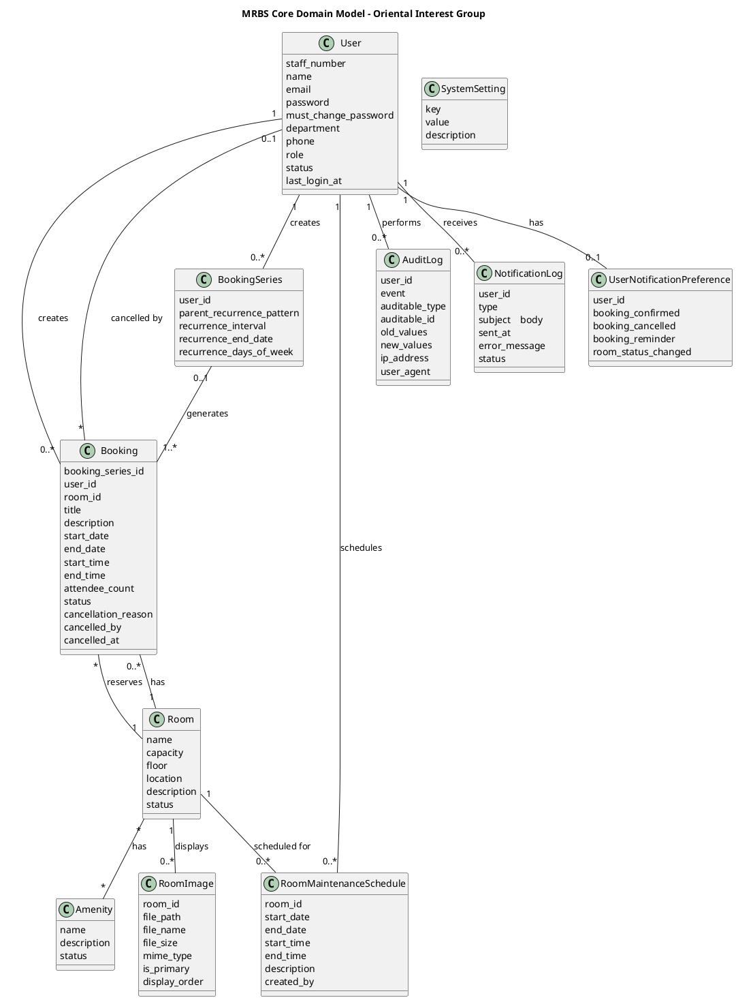

# MRBS System Domain Diagram

This document provides the domain diagram for the Meeting Room Booking System (MRBS) for Oriental Interest Group, modeling the business domain with entities, attributes, and their relationships.

---

## What is a Domain Diagram?

A **Domain Diagram** (also called **Domain Model** or **Conceptual Class Diagram**) is a simplified UML class diagram that focuses on:

1. **Business Entities** - Real-world concepts in your problem domain
2. **Attributes** - Data that describes each entity (without technical details like types/visibility)
3. **Relationships** - How entities are connected (with multiplicity/cardinality)
4. **Business Rules** - Constraints and validations embedded in the structure

### Key Differences from Technical Class Diagrams

| Aspect | Domain Diagram | Technical Class Diagram |
|--------|---------------|------------------------|
| **Purpose** | Model business concepts | Model software structure |
| **Audience** | Business stakeholders, analysts | Developers, architects |
| **Operations** | ❌ Not included | ✅ Methods and functions |
| **Visibility** | ❌ Not shown (`+`, `-`, `#`) | ✅ Public/Private/Protected |
| **Data Types** | ❌ Optional, simplified | ✅ Explicit (string, int, DateTime) |
| **Relationships** | ✅ Business relationships | ✅ Technical dependencies |
| **Multiplicity** | ✅ **Required** (1..1, 0..*) | ✅ Required |

### What to Include in Domain Diagrams

✅ **Include:**
- Business entities (User, Booking, Room, etc.)
- Entity attributes (name, email, capacity, etc.)
- Relationships between entities (User creates Booking)
- Multiplicity/cardinality (1 User → many Bookings)
- Enumerations for business states (Status: active, inactive)
- Business constraints (e.g., "Booking cannot overlap")

❌ **Exclude:**
- Method signatures and operations
- Getter/setter methods
- Visibility modifiers (+, -, #)
- Technical implementation details (database columns, indexes)
- Framework-specific annotations
- Constructor details

---

## Web Development Context

### Why Domain Diagrams Matter in Web Development

1. **Bridge Business and Tech**
   - Helps non-technical stakeholders understand the system
   - Ensures developers understand business requirements
   - Creates a shared vocabulary

2. **Database Design Foundation**
   - Domain entities → Database tables
   - Relationships → Foreign keys
   - Attributes → Table columns
   - Note: **Domain ≠ Database** (domain is conceptual, database is technical)

3. **API Design**
   - Domain entities → API resources (RESTful endpoints)
   - Example: `Room` entity → `/api/rooms` endpoint

4. **Frontend Data Modeling**
   - Domain model guides what data the frontend needs
   - Example: Booking entity attributes → Booking form fields

5. **Validation Rules**
   - Domain constraints → Form validation rules

### Laravel/Web Application Mapping

| Domain Diagram | Laravel Application |
|----------------|---------------------|
| **Entity** | Eloquent Model |
| **Attribute** | Model property / Database column |
| **Relationship (1-to-many)** | `hasMany()` / `belongsTo()` |
| **Relationship (many-to-many)** | `belongsToMany()` with pivot table |
| **Value** | String value or Enum |

---

## MRBS Domain Entities Classification

The following table classifies each element in the core domain model:

| Entity | Classification | Description |
|--------|---------------|-------------|
| **User** | Entity | Staff members who use the booking system |
| **Room** | Entity | Meeting rooms available for reservation |
| **Amenity** | Entity | Facilities available in meeting rooms |
| **Booking** | Entity | Room reservations made by users |
| **BookingSeries** | Entity | Recurring booking patterns |
| **RoomImage** | Entity | Images showcasing meeting rooms |
| **RoomMaintenanceSchedule** | Entity | Scheduled maintenance periods for rooms |
| **AuditLog** | Entity | System activity logs for compliance |
| **NotificationLog** | Entity | Email notification delivery records |
| **UserNotificationPreference** | Entity | User email notification settings |
| **SystemSetting** | Entity | System-wide configuration key-value pairs |

---

## Core Domain Model Diagram



---

## Entity Descriptions

This section explains each entity shown in the core domain model diagram above.

---

### 1. User

**Business Description:**  
Represents staff members of Oriental Interest Group who use the MRBS to book meeting rooms. Each user has a unique staff number and is assigned one of four system roles.

**Attributes:**
- `staff_number` - Unique identifier for the staff member
- `name` - Full name of the user
- `email` - Email address for login and notifications
- `password` - Encrypted password for authentication
- `must_change_password` - Flag requiring password change on next login
- `department` - Department or division the user belongs to
- `phone` - Contact phone number
- `role` - System role (regular_user, administrator, director, system_admin)
- `status` - Account status (active, inactive)
- `last_login_at` - Timestamp of last successful login

**Relationships:**
- User creates many Bookings (1 → 0..*)
- User creates many BookingSeries for recurring bookings (1 → 0..*)
- User schedules many RoomMaintenanceSchedules (1 → 0..*)
- User has one UserNotificationPreference (1 → 0..1)
- User performs many AuditLog actions (1 → 0..*)
- User receives many NotificationLogs (1 → 0..*)

**Business Rules:**
- `staff_number` must be unique across all users
- `email` must be unique
- New users must change their temporary password on first login
- Inactive users cannot log in or create bookings
- Only administrators can create user accounts(no self-registration)

**Role Values:**
- `regular_user` - Standard staff members who book rooms
- `administrator` - Manages rooms and bookings
- `director` - User management and audit access
- `system_admin` - Full system configuration access

**Status Values:**
- `active` - User can log in and use the system
- `inactive` - User account is disabled

---

### 2. Room

**Business Description:**  
Physical meeting rooms within the Oriental Interest Group building available for staff to book. Rooms are organized by floor and have specific capacities and amenities.

**Attributes:**
- `name` - Room name or identifier (e.g., "Conference Room A")
- `capacity` - Maximum number of people the room can accommodate
- `floor` - Floor level where the room is located (e.g., "Ground Floor", "1st Floor")
- `location` - Additional location details within the building
- `description` - Detailed description of the room and its features
- `status` - Room availability status (active, inactive, under_maintenance)

**Relationships:**
- Room has many Bookings (1 → 0..*)
- Room displays many RoomImages (1 → 0..*)
- Room has many RoomMaintenanceSchedules (1 → 0..*)
- Room has many Amenities (* → *) [many-to-many]

**Business Rules:**
- Room name must be unique
- Capacity must be a positive number
- Cannot delete rooms with future bookings
- Rooms with status `under_maintenance` cannot be booked
- Inactive rooms are hidden from search but existing bookings remain valid

**Status Values:**
- `active` - Room is available for booking
- `inactive` - Room temporarily unavailable
- `under_maintenance` - Room undergoing maintenance (cannot book)

---

### 3. Amenity

**Business Description:**  
Facilities and equipment available in meeting rooms to help staff choose appropriate rooms for their needs.

**Attributes:**
- `name` - Amenity name (e.g., "Projector", "Whiteboard", "Video Conferencing")
- `description` - Detailed description of the amenity
- `status` - Amenity status (active, inactive)

**Relationships:**
- Amenity belongs to many Rooms (* → *) [many-to-many via amenity_room pivot table]

**Business Rules:**
- Amenity name must be unique
- Same amenity can be assigned to multiple rooms
- Inactive amenities are hidden from room searches
- Cannot delete amenities assigned to active rooms

**Status Values:**
- `active` - Amenity is operational and displayed
- `inactive` - Amenity temporarily unavailable or not displayed

---

### 4. Booking

**Business Description:**  
Represents a single room reservation made by a user. Can be a standalone booking or part of a recurring series.

**Attributes:**
- `booking_series_id` - Reference to BookingSeries if part of recurring pattern (null for one-time bookings)
- `user_id` - User who created this booking
- `room_id` - Room being reserved
- `title` - Purpose or title of the meeting
- `description` - Additional details about the meeting
- `start_date` - Date the booking starts
- `end_date` - Date the booking ends
- `start_time` - Start time of the booking
- `end_time` - End time of the booking
- `attendee_count` - Expected number of attendees
- `status` - Booking status (pending, confirmed, cancelled, completed)
- `cancellation_reason` - Reason for cancellation (if cancelled)
- `cancelled_by` - User ID who cancelled the booking
- `cancelled_at` - Timestamp when booking was cancelled

**Relationships:**
- Booking belongs to one User (creator) (* → 1)
- Booking reserves one Room (* → 1)
- Booking may belong to one BookingSeries (* → 0..1)
- Booking may be cancelled by one User (* → 0..1)

**Business Rules:**
- Cannot book a room with dates/times that overlap with existing confirmed bookings
- Cannot book rooms that are under maintenance
- End date/time must be after start date/time
- Cannot modify past bookings
- Only booking creator, administrators, or directors can cancel a booking
- Cancelled bookings must have a cancellation reason
- First-come-first-served: bookings are auto-confirmed if no conflicts exist
- Bookings automatically transition to "completed" status after end time passes

**Status Values:**
- `pending` - Booking created (may be used for approval workflow in future)
- `confirmed` - Booking approved and scheduled
- `cancelled` - Booking was cancelled with reason
- `completed` - Booking end time has passed (auto-updated)

---

### 5. BookingSeries

**Business Description:**  
Manages recurring booking patterns (e.g., "Every Monday for 3 months"). Generates individual Booking instances based on recurrence rules.

**Attributes:**
- `user_id` - User who created this recurring series
- `parent_recurrence_pattern` - Pattern type (daily, weekly, monthly)
- `recurrence_interval` - Interval between recurrences (e.g., every 1 week, every 2 weeks)
- `recurrence_end_date` - Date when the recurrence pattern stops
- `recurrence_days_of_week` - For weekly patterns, which days to recur (e.g., "Monday,Wednesday")

**Relationships:**
- BookingSeries generates many Bookings (1 → 1..*)
- BookingSeries belongs to one User (* → 1)

**Business Rules:**
- Must generate at least one Booking instance
- Recurrence end date must be after the first booking's start date
- Cannot modify series after bookings are generated (must cancel and recreate)
- Weekly patterns must specify at least one day of the week
- Each generated booking follows the same conflict prevention rules as standalone bookings

**Pattern Values:**
- `daily` - Repeats every day or every N days
- `weekly` - Repeats on specific days of the week
- `monthly` - Repeats on specific day of the month

---

### 6. RoomImage

**Business Description:**  
Images showcasing meeting rooms to help users make informed booking decisions. Supports multiple images per room with primary image designation.

**Attributes:**
- `room_id` - Room this image belongs to
- `file_path` - Storage path to the image file
- `file_name` - Original filename
- `file_size` - File size in bytes
- `mime_type` - Image file type (image/jpeg, image/png)
- `is_primary` - Flag indicating if this is the primary/featured image
- `display_order` - Order for displaying multiple images (e.g., 1, 2, 3)

**Relationships:**
- RoomImage belongs to one Room (* → 1)

**Business Rules:**
- Each room can have only one primary image
- Must be valid image format (JPEG, PNG)
- Images are displayed in ascending `display_order`
- Deleting a room deletes all associated images

---

### 7. RoomMaintenanceSchedule

**Business Description:**  
Scheduled maintenance periods when rooms are unavailable for booking. Prevents conflicts and ensures proper room upkeep.

**Attributes:**
- `room_id` - Room undergoing maintenance
- `start_date` - Maintenance start date
- `end_date` - Maintenance end date
- `start_time` - Start time of maintenance
- `end_time` - End time of maintenance
- `description` - Details about the maintenance work
- `created_by` - User ID (administrator or director) who scheduled the maintenance

**Relationships:**
- RoomMaintenanceSchedule belongs to one Room (* → 1)
- RoomMaintenanceSchedule created by one User (* → 1)

**Business Rules:**
- Cannot book a room during its maintenance period
- End date/time must be after start date/time
- Maintenance schedules cannot overlap for the same room
- Only administrators and directors can create maintenance schedules
- Room status automatically changes to `under_maintenance` during the scheduled period

---

### 8. AuditLog

**Business Description:**  
Immutable record of all significant system activities for security, compliance, and troubleshooting. Tracks who did what and when.

**Attributes:**
- `user_id` - User who performed the action (null for system actions)
- `event` - Type of action performed (e.g., "created", "updated", "deleted", "logged_in")
- `auditable_type` - Type of entity affected (e.g., "App\\Models\\Booking", "App\\Models\\User")
- `auditable_id` - ID of the affected entity
- `old_values` - Previous values before the change (JSON format)
- `new_values` - New values after the change (JSON format)
- `ip_address` - IP address of the user
- `user_agent` - Browser/client information

**Relationships:**
- AuditLog belongs to one User (* → 1)

**Business Rules:**
- Audit logs are immutable (cannot be modified or deleted)
- All administrative actions must be logged automatically
- Sensitive data (passwords) are excluded from logs
- Only directors and system admins can view audit logs
- Logs are used for compliance and forensic analysis

**Common Event Values:**
- `created` - New entity created
- `updated` - Entity modified
- `deleted` - Entity deleted/deactivated
- `logged_in` - User logged in
- `logged_out` - User logged out
- `password_changed` - Password updated

---

### 9. NotificationLog

**Business Description:**  
Records of all email notifications sent to users, tracking delivery status and errors for troubleshooting.

**Attributes:**
- `user_id` - Recipient user
- `type` - Notification type (e.g., "booking_confirmed", "booking_cancelled")
- `subject` - Email subject line
- `body` - Email body content
- `sent_at` - Timestamp when email was sent
- `error_message` - Error details if delivery failed
- `status` - Delivery status (pending, sent, failed)

**Relationships:**
- NotificationLog belongs to one User (* → 1)

**Business Rules:**
- Cannot delete notification logs (audit trail)
- Failed notifications can be inspected for troubleshooting
- Only sent if system-wide email is enabled and user has opted in (for optional notifications)
- Critical notifications (welcome email, password reset) are always sent

**Type Values:**
- `booking_confirmed` - Booking successfully created
- `booking_cancelled` - Booking was cancelled
- `booking_reminder` - Reminder before meeting starts
- `room_status_changed` - Room status updated (maintenance, etc.)
- `welcome_email` - New user account created
- `password_reset` - Password reset link

**Status Values:**
- `pending` - Queued to be sent
- `sent` - Successfully delivered
- `failed` - Delivery failed (see `error_message`)

---

### 10. UserNotificationPreference

**Business Description:**  
User-specific email notification preferences allowing users to opt-in or opt-out of different notification types.

**Attributes:**
- `user_id` - User these preferences belong to
- `booking_confirmed` - Receive booking confirmation emails (true/false)
- `booking_cancelled` - Receive booking cancellation emails (true/false)
- `booking_reminder` - Receive booking reminder emails (true/false)
- `room_status_changed` - Receive room status change notifications (true/false)

**Relationships:**
- UserNotificationPreference belongs to one User (1 → 1)

**Business Rules:**
- Each user has exactly one preference record
- Created automatically when user account is created
- Default is `true` (opted-in) for all notification types
- Critical notifications (welcome email, password reset) ignore these preferences
- Must respect system-level email settings (if email is disabled globally, no notifications are sent)

---

### 11. SystemSetting

**Business Description:**  
System-wide configuration key-value pairs for controlling application behavior without code changes.

**Attributes:**
- `key` - Unique setting name (e.g., "booking_max_duration", "session_timeout")
- `value` - Setting value (stored as string)
- `description` - Human-readable description of the setting

**Business Rules:**
- Only system administrators can view and modify settings
- `key` must be unique
- Changes to settings may affect system behavior immediately or require cache clearing

**Common Settings:**
- `booking_max_duration` - Maximum booking duration in hours
- `booking_min_duration` - Minimum booking duration in minutes
- `booking_cancellation_deadline` - Hours before start time when cancellation is allowed
- `session_timeout` - Session timeout in minutes
- `email_enabled` - Master toggle for all email notifications
- `notify_booking_confirmed` - System-level toggle for booking confirmation emails

---

## Key Business Rules Summary

These rules govern how entities interact and ensure data integrity:

### User Management
- Staff numbers must be unique
- Email addresses must be unique
- No self-registration (administrators create accounts)
- New users must change temporary password on first login
- Inactive users cannot log in or create bookings

### Room Management
- Room names must be unique
- Room capacity must be positive
- Cannot delete rooms with future bookings
- Rooms under maintenance cannot be booked

### Booking Management
- First-come-first-served (auto-confirmed if no conflicts)
- No overlapping bookings for the same room and time
- Cannot book rooms during maintenance periods
- Cannot modify past bookings
- End time must be after start time
- Bookings automatically complete after end time
- Cancelled bookings must have a reason

### Recurring Bookings
- BookingSeries must generate at least one Booking
- Recurrence end date must be after first booking date
- Each generated booking follows same conflict prevention rules

### Maintenance Scheduling
- Only administrators and directors can schedule maintenance
- Maintenance schedules cannot overlap for same room
- Room status changes to `under_maintenance` during scheduled period

### Notifications
- Users can opt-out of non-critical notifications
- Critical notifications (welcome, password reset) always sent
- Respects system-level email enable/disable setting

### Security & Compliance
- All administrative actions logged in AuditLog
- Audit logs are immutable
- Passwords are hashed (never stored plain text)

---

## Relationship Multiplicity Examples

Understanding the numbers in relationships:

| Relationship | Multiplicity | Meaning |
|--------------|--------------|---------|
| User → Booking | 1 → 0..* | One user creates zero or more bookings |
| Booking → User | * → 1 | Many bookings belong to one user (creator) |
| Booking → Room | * → 1 | Many bookings reserve one room |
| Room → Booking | 1 → 0..* | One room has zero or more bookings |
| Room → Amenity | * → * | Many rooms have many amenities (many-to-many) |
| BookingSeries → Booking | 1 → 1..* | One series generates one or more bookings (at least one) |
| Booking → BookingSeries | * → 0..1 | Many bookings may belong to zero or one series |
| User → UserNotificationPreference | 1 → 0..1 | One user has zero or one preference record |
| Room → RoomImage | 1 → 0..* | One room displays zero or more images |

---

## Mapping Domain to Laravel

### Domain Entity → Eloquent Model

```php
// Domain: User Entity
// Laravel: app/Models/User.php

class User extends Model
{
    // Domain attributes become $fillable properties
    protected $fillable = [
        'staff_number', 'name', 'email', 'password',
        'must_change_password', 'department', 'phone', 
        'role', 'status'
    ];
    
    // Domain relationships become Eloquent methods
    public function bookings() {
        return $this->hasMany(Booking::class);
    }
    
    public function notificationPreferences() {
        return $this->hasOne(UserNotificationPreference::class);
    }
}
```

### Domain Relationships → Database Schema

```sql
-- Domain: User "1" -- "0..*" Booking
-- Database: Foreign key in bookings table

CREATE TABLE bookings (
    id SERIAL PRIMARY KEY,
    user_id INTEGER NOT NULL,
    room_id INTEGER NOT NULL,
    FOREIGN KEY (user_id) REFERENCES users(id),
    FOREIGN KEY (room_id) REFERENCES rooms(id)
);

-- Domain: Room "*" -- "*" Amenity
-- Database: Pivot table

CREATE TABLE amenity_room (
    amenity_id INTEGER NOT NULL,
    room_id INTEGER NOT NULL,
    PRIMARY KEY (amenity_id, room_id),
    FOREIGN KEY (amenity_id) REFERENCES amenities(id),
    FOREIGN KEY (room_id) REFERENCES rooms(id)
);
```

### Domain Business Rules → Validation

```php
// Domain Rule: "Cannot book overlapping rooms"
// Laravel: Validation in BookingService

public function validateNoConflict($booking) {
    $conflict = Booking::where('room_id', $booking->room_id)
        ->where('status', 'confirmed')
        ->where(function ($query) use ($booking) {
            $query->whereBetween('start_date', [$booking->start_date, $booking->end_date])
                  ->orWhereBetween('end_date', [$booking->start_date, $booking->end_date]);
        })
        ->exists();
        
    if ($conflict) {
        throw new BookingConflictException('Room is already booked for this time period');
    }
}
```

---

## Benefits of Domain Diagrams in MRBS

1. **Clear Communication**
   - Stakeholders understand what the system models
   - Developers have a blueprint for database design
   - Everyone speaks the same language

2. **Consistent Terminology**
   - "Booking" not "Reservation"
   - "Room" not "Space" or "Resource"
   - "Amenity" not "Facility" or "Equipment"

3. **Validation Foundation**
   - Business rules visible in diagram
   - Easy to derive form validation rules
   - API contracts match domain model

4. **API Design Guide**
   - Domain entities map to REST resources
   - Example: `Room` → `/api/rooms`, `Booking` → `/api/bookings`

5. **Documentation**
   - Serves as living documentation of business logic
   - Easier onboarding for new developers
   - Single source of truth for system structure

---

## Notes

- **Domain ≠ Database**: Domain models business concepts; database models technical storage
- **Attributes are simplified**: No data types, no visibility, focus on "what" not "how"
- **Relationships are critical**: Multiplicity conveys business rules (1-to-many, many-to-many)
- **Business language**: Use terminology from requirements document
- **Internal system**: No payment, billing, or public-facing registration features

---

## References

- **UML Specification**: Class diagrams without operations
- **MRBS Requirements Document**: `docs/requirement/requirements-document.md`
- **Laravel Eloquent ORM**: Maps domain entities to database models
- **Client**: Oriental Interest Group
