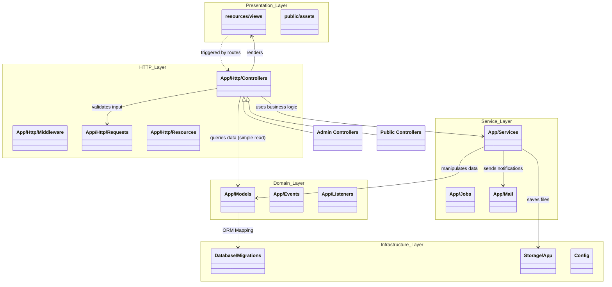

# Meeting Room Booking System (MRBS) - Package Diagram

The following diagram illustrates the high-level package structure and dependencies within the MRBS application, following standard Laravel architecture patterns.

## System Layered Architecture

## Detailed Package Decomposition

### 1. Presentation Layer
*   **Views**: Blade templates responsible for the UI (Layouts, Pages, Components).
*   **Assets**: CSS, JavaScript, and Image resources.

### 2. HTTP Layer (Application Entry)
*   **Controllers**: Handles incoming HTTP requests.
    *   *Admin*: `RoomController`, `UserController`, `ReportController`.
    *   *Public*: `BookingController`, `ProfileController`.
*   **Requests**: Form request classes for validation rules (e.g., `StoreBookingRequest`).
*   **Middleware**: Request filtering (e.g., `Auth`, `RoleCheck`).

### 3. Service Layer (Business Logic)
*   **Services**: Encapsulates complex business rules.
    *   `BookingService`: Availability checks, conflict resolution.
    *   `RoomImageService`: File handling for room photos.
    *   `AuditService`: Centralized logging logic.
    *   `ReportService`: Data aggregation for exports.

### 4. Domain Layer (Data & State)
*   **Models**: Eloquent ORM representations of database tables.
    *   `User`, `Room`, `Booking`, `Amenity`.
*   **Events/Listeners**: Side-effect handling (e.g., sending email after successful booking - *Planned Phase 4*).

### 5. Infrastructure Layer
*   **Database**: Migrations, Seeds, and the actual SQL storage.
*   **Storage**: File system interactions (Local/S3).
