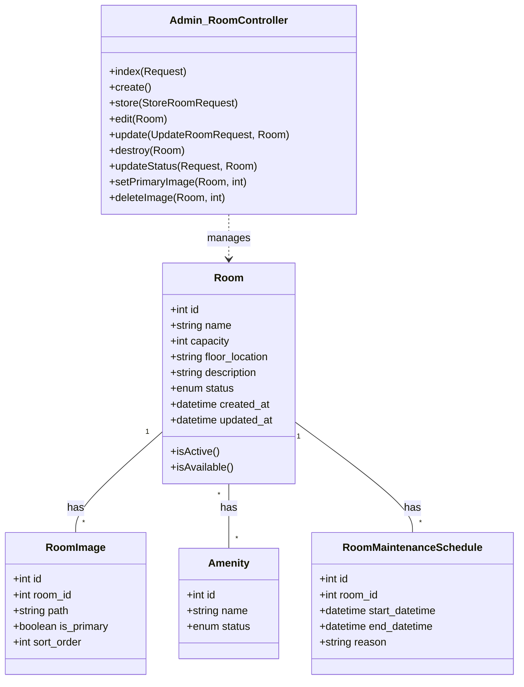
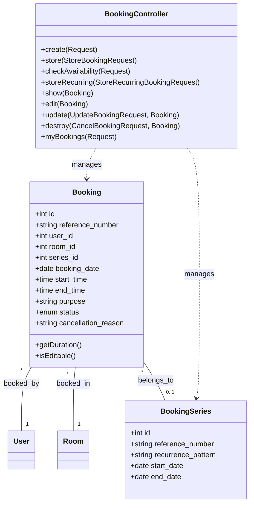
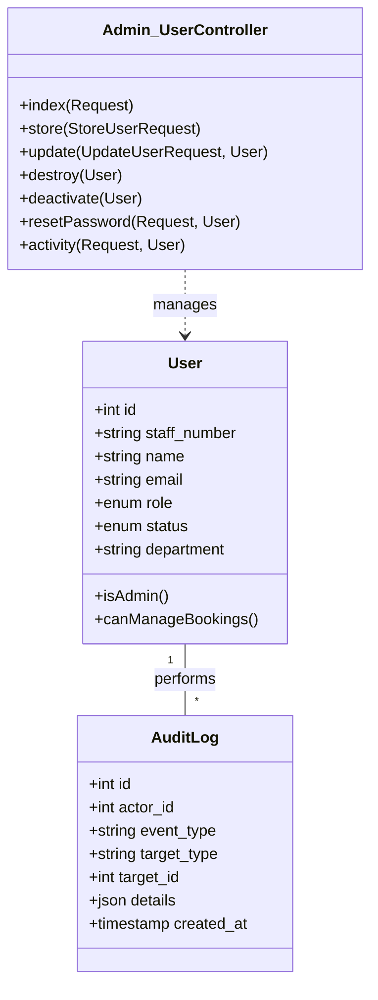

# Meeting Room Booking System (MRBS) - Technical Documentation

## Subsystem 1: Meeting Rooms Management

### Class Breakdown

**Models:**
*   `Room`: Represents a meeting space.
*   `Amenity`: Features available in a room (e.g., Projector, Whiteboard).
*   `RoomImage`: Photos associated with a room.
*   `RoomMaintenanceSchedule`: Scheduled unavailability periods for maintenance.

**Controller:** `Admin\RoomController`

### Class Diagram

### Controller Method Logic

**Entity Name:** `Room`
**Controller:** `Admin\RoomController`

#### Method: `store`
**Input:** Name, Capacity, Floor Location, Description, Amenities (array), Images (files)
**Output:** Redirects to Index with Success Message

**Algorithm:**
1.  **Start**
2.  **Validate** incoming request data (unique name, capacity > 0, etc.).
3.  **Create** new `Room` record with validated data.
4.  **If** amenities are provided:
    *   Attach selected amenities to the room via pivot table.
5.  **If** images are provided:
    *   Upload files to storage.
    *   Create `RoomImage` records linked to the room.
6.  **Log Audit Event**: Record `ROOM_CREATED` event with details (name, capacity, location).
7.  **Return** redirect to room list with success message.
8.  **End**

#### Method: `update`
**Input:** Room ID, Updated Fields (Name, Capacity, etc.), Amenities, New Images
**Output:** Redirects to Edit Page with Success Message

**Algorithm:**
1.  **Start**
2.  **Capture** current state (old values) for audit comparison.
3.  **Update** `Room` record with validated data.
4.  **Sync** amenities (add new, remove unselected).
5.  **Compute Changes**: Compare old values vs new values.
6.  **If** file uploads exist:
    *   Upload new images and attach to room.
7.  **If** changes occurred:
    *   **Log Audit Event**: Record `ROOM_UPDATED` with specific field changes (e.g., "Capacity changed from 10 to 20").
8.  **Return** redirect to edit page with success message.
9.  **End**

#### Method: `destroy`
**Input:** Room object
**Output:** Redirects to Index (Success or Error)

**Algorithm:**
1.  **Start**
2.  **Check Bookings**: Query if the room has *any* associated bookings (past or future).
3.  **If** bookings exist:
    *   **Return** error message: "Cannot delete room with bookings. Deactivate instead."
    *   **Stop**.
4.  **Else** (no bookings):
    *   **Delete Images**: Remove physical image files and database records.
    *   **Force Delete**: Permanently remove `Room` record.
    *   **Log Audit Event**: Record `ROOM_DELETED`.
    *   **Return** success message.
5.  **End**

---

## Subsystem 2: Booking Management

### Class Breakdown

**Models:**
*   `Booking`: The core reservation record.
*   `BookingSeries`: Grouping for recurring bookings.
*   `User`: The person making the booking.

**Controller:** `BookingController` (Public/User facing)

### Class Diagram

### Controller Method Logic

**Entity Name:** `Booking`
**Controller:** `BookingController`

#### Method: `store` (Create Single Booking)
**Input:** Room ID, Date, Start Time, End Time, Purpose
**Output:** Redirect to Dashboard with Reference Number

**Algorithm:**
1.  **Start**
2.  **Validate** inputs (valid times, future date, existing room).
3.  **Call Service**: `BookingService->createBooking method`.
    *   *Service Step*: Check if room is available for the requested time slot (concurrency check).
    *   *Service Step*: If occupied, throw exception.
    *   *Service Step*: Generate unique Reference Number (e.g., BK-2025-001).
    *   *Service Step*: Create `Booking` record with status `confirmed`.
4.  **Log Audit Event**: Record `BOOKING_CREATED` with booking details.
5.  **Return** success message with reference number.
6.  **Exception Handling**: If availability check fails, return error "Time slot just taken".
7.  **End**

#### Method: `destroy` (Cancel Booking)
**Input:** Booking ID, Cancellation Reason
**Output:** Redirect with Success Message

**Algorithm:**
1.  **Start**
2.  **Authorize**: Check if user owns the booking OR is an Admin/Director.
3.  **Check Status**: Ensure booking is currently `confirmed` and not in the past.
4.  **If** booking is recurring:
    *   **Call Service**: `cancelSeries` to cancel all future bookings in the set.
    *   **Log Audit Event**: `BOOKING_SERIES_CANCELLED`.
5.  **Else** (single booking):
    *   **Call Service**: `cancelBooking`.
    *   Update status to `cancelled`.
    *   Record `cancelled_by`, `cancelled_at`, and `reason`.
    *   **Log Audit Event**: `BOOKING_CANCELLED`.
6.  **Return** success message.
7.  **End**

#### Method: `checkAvailability` (AJAX)
**Input:** Room ID, Date, Start Time, End Time
**Output:** JSON { available: boolean, conflict: details }

**Algorithm:**
1.  **Start**
2.  **Call Service**: Query database for overlapping `confirmed` bookings in the specific room and time range.
3.  **If** overlap found:
    *   Retrieve conflict details (e.g., "Meeting with HR" usually hidden for privacy, just returns "Reserved").
    *   **Return** JSON `available: false`.
4.  **Else**:
    *   **Return** JSON `available: true`.
5.  **End**

---

## Subsystem 3: Administrative Management

### Class Breakdown

**Models:**
*   `User`: System accounts (Staff/Admins).
*   `AuditLog`: Security and activity tracking.

**Controller:** `Admin\UserController`

### Class Diagram

### Controller Method Logic

**Entity Name:** `User`
**Controller:** `Admin\UserController`

#### Method: `store` (Create User)
**Input:** Staff Number, Name, Email, Department, Role, Phone
**Output:** Redirect with Success/Temp Password

**Algorithm:**
1.  **Start**
2.  **Validate** unique email and staff number.
3.  **Generate** temporary password.
4.  **Create** `User` record:
    *   Set `status` = 'active'.
    *   Set `must_change_password` = true.
    *   Hash temporary password.
5.  **Log Audit Event**: `USER_CREATED` by Admin.
6.  **Return** success message displaying the temporary password (or indicating email sent).
7.  **End**

#### Method: `destroy` (Delete User)
**Input:** User object
**Output:** Redirect Success or Error

**Algorithm:**
1.  **Start**
2.  **Self-Check**: If Admin tries to delete themselves -> Error "Cannot delete own account".
3.  **Dependency Check 1**: Count user's `bookings`.
    *   If > 0 -> Error "Cannot delete user with bookings. Deactivate instead."
4.  **Dependency Check 2**: Count user's `audit_logs` (actions performed).
    *   If > 0 -> Error "Cannot delete user with history. Deactivate instead."
5.  **If** checks pass (clean user):
    *   **Force Delete** user record.
    *   **Log Audit Event**: `USER_DELETED` (includes deleted user's name/email in log data for reference).
    *   **Return** success message.
6.  **End**

#### Method: `resetPassword`
**Input:** User ID, Method ('generate' or 'email')
**Output:** Feedback Message

**Algorithm:**
1.  **Start**
2.  **If** method is 'generate':
    *   Create random temporary string.
    *   **Update** User: Set `password` = Hash(temp), `must_change_password` = true.
    *   **Log Audit Event**: `PASSWORD_RESET_BY_ADMIN` (type: manual).
    *   **Return** temporary password to Admin.
3.  **Else if** method is 'email':
    *   **Trigger** Laravel Password Reset Link system.
    *   **Log Audit Event**: `PASSWORD_RESET_BY_ADMIN` (type: email link).
    *   **Return** confirmation that link was sent.
4.  **End**
